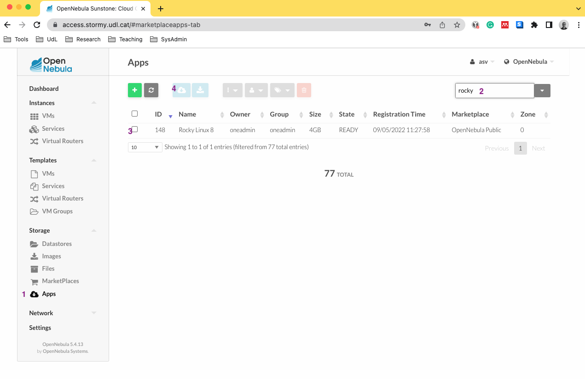
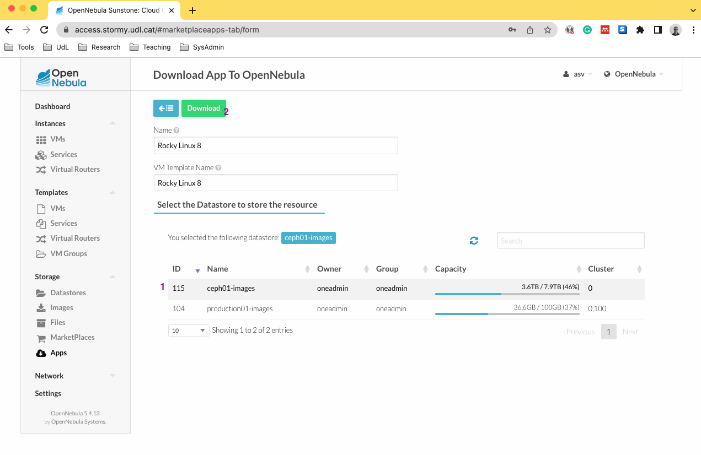
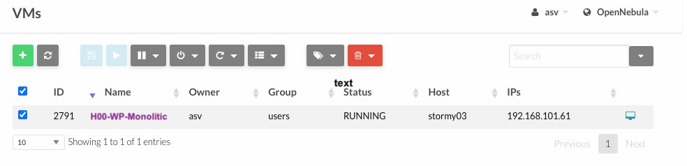
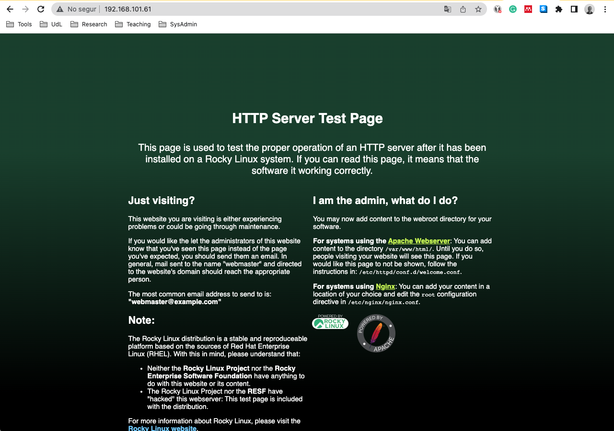
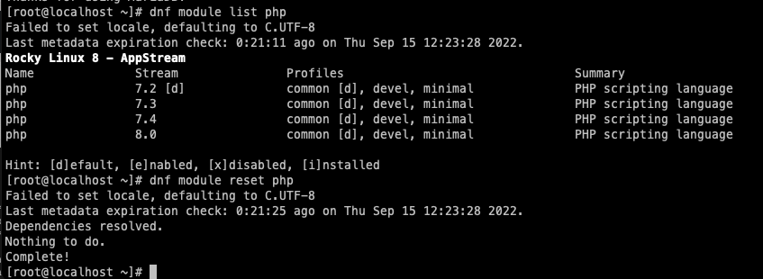

# Fase 1: Desplegament Monolític

En la primera etapa del projecte, optem per una solució senzilla amb una configuració tot en una màquina virtual per acomodar el petit trànsit inicial del lloc web. Aquesta elecció ofereix simplicitat i rapidesa en el desplegament, permetent-nos centrar-nos en la creació i la personalització del lloc web sense invertir molts recursos en la infraestructura.


## Rocky Linux

**Rocky Linux** és una distribució de sistema operatiu de codi obert basada en *Red Hat Enterprise Linux (RHEL)*. Ha estat dissenyada per ser una alternativa comunitària i totalment compatible amb **RHEL**, després de l'aparició de *CentOS Stream* com a versió de desenvolupament de **RHEL**. Com a administrador de sistemes, la selecció de **Rocky Linux** pot oferir diverses avantatges i alguns inconvenients, depenent de les necessitats del vostre projecte.

### Avantatges de Rocky Linux

* **Compatibilitat amb RHEL**: Les aplicacions i les configuracions desenvolupades per a **RHEL** es poden utilitzar sense problemes en Rocky Linux.
* **Seguretat i Actualitzacions**: Rocky Linux ofereix actualitzacions de seguretat regulars i suport a llarg termini, la qual cosa el fa una opció estable per a entorns de producció.
* **Comunitat Activa**: Com a una distribució de codi obert, Rocky Linux compta amb una comunitat activa d'usuaris i desenvolupadors que poden proporcionar suport i recursos addicionals.
  
### Inconvenients de Rocky Linux

* **Manca de Suport Comercial**: Tot i que existeixen empreses que ofereixen suport comercial per a Rocky Linux, aquest no és tan estandarditzat ni àmpli com el suport de Red Hat per a RHEL.
* **Requeriments de Coneixements**: Utilitzar una distribució com Rocky Linux pot requerir coneixements addicionals en comparació amb distribucions més simples, ja que potser necessiteu configurar més aspectes manualment.
  
### Raons de Selecció

* Si teniu experiència amb RHEL o CENTOS i busqueu una alternativa de codi obert compatible i no obsoleta.
* Si necessiteu una distribució estable per a entorns de producció sense les despeses associades al suport de Red Hat.

### Aconseguint una imatge Rocky Linux

Seleccionem el sistema operatiu Rocky Linux, una distribució Linux robusta i de codi obert que utilitzarem com a base per al nostre servidor web. Aquesta elecció es deu a la seva fiabilitat i a la seva compatibilitat amb tecnologies web com Apache, PHP i MariaDB.

Per fer-ho a la plataforma que emula un cloud privat (*stormy*) seguirem els següents passos:

1. Fes clic a l'opció **Apps**.
2. Cerca **Rocky** a la barra de cerca.
3. Selecciona la opció corresponent a **Rocky**.
4. Feu clic per iniciar la descàrrega.



1. Escull l'opció que es correspongui amb *115 ceph01-images*.
2. Fes clic a **Descarregar** o **Baixar**.



Sempre heu de fer servir el **datastore** *115* del laboratori.

### Iniciant una màquina virtual

1. Crear una màquina virtual amb la plantilla de Rocky.
2. Configureu els següents recursos: **4GB de RAM, 8GB de disc i 1 CPU**.
3. Assigneu la plantilla a la xarxa *Shared Network*.
4. Anomeneu la màquina **H00-WP-Monolitic**.



### Preparant el Sistema Operatiu

Un cop creada la màquina virtual, actualitzem el sistema operatiu mitjançant la comanda següent per garantir que disposem de les últimes actualitzacions de seguretat i correccions. És molt important com a administrador de sistemes tenir el sistema operatiu actualitzat. Per tant, és una bona pràctica iniciar la configuració actualitzant el sistema.

```sh
 dnf -y update
```

Aquesta comanda actualitza tots els paquets del sistema amb l'ús del gestor de paquets **DNF**. L'opció *-y* respon automàticament **sí** a totes les preguntes de confirmació, permetent una actualització sense intervenció de l'usuari.

També, si no voleu interactuar amb el **vi** us podeu instal·lar el **vim** , **emacs** o el **nano**.

```sh
dnf install vim -y
dnf install nano -y
dnf install emacs -y
```

### Configurant un servidor LAMP

LAMP és un acrònim de Linux que serveix per referir-se a servidor que inclou Apache, MySQL (o MariaDB) i PHP.

#### Instal·lació d'Apache

Instal·lem el dimoni httpd:

```sh
dnf install httpd -y
```

Activem el dimoni per iniciar cada cop que el sistema arranqui:

```sh
systemctl enable httpd
```

Aquesta comanda habilita un servei (en aquest cas httpd) perquè s'iniciï automàticament en l'arrencada del sistema. Qualsevol servei del sistema es pot configurar o no per arrancar quan arranqui el sistema i es decisió de l'administrador gestionar-ho.

Arranquem i comprovem l'estat del dimoni:

```sh
systemctl start httpd
systemctl status httpd
```

Aquesta comanda (```systemctl status x```) mostra l'estat d'un servei de sistema anomenat **x**. Ens mostrarà l'estat actual del servei **x**, indicant si està en execució (en estat **RUNNING**) o no, així com altres informacions rellevants que poden ser útils per a la supervisió i el diagnòstic.

Què passarà si executo com a admin ```systemctl disable httpd; reboot; systemctl status httpd```?

* ```systemctl disable httpd```: Aquesta comanda deshabilitarà el servei Apache perquè no s'iniciï automàticament en l'arrencada del sistema. Això significa que, després de reiniciar el sistema, el servei Apache romandrà aturat.

* ```reboot```: Aquesta comanda reiniciarà el sistema.

* ```systemctl status httpd```: Un cop s'hagi reiniciat el sistema, aquesta comanda mostrarà l'estat del servei Apache. En aquest punt, el servei estarà aturat, i veuràs que indica que està **inactive** o **dead**.

Per utilitzar el servei Apache després d'aquestes comandes, hauràs de fer-ho manualment amb ```systemctl start httpd```, ja que no es reiniciarà automàticament amb el sistema. Així que si desitges utilitzar Apache després d'un reinici, hauràs de recordar iniciar-lo manualment.

Finalment, obriu un navegador i navegeu a la vostra **IP** per comprovar que el servidor us funciona correctament:



En aquest cas el servidor amb IP: **192.168.101.61** al port **80** té configurat correctament un servidor d'Apache. *En cas contrari, s'ha de revisar la configuració fins aconseguir accedir correctament.*

Però, el nom d'una direcció IP no sempre es trivial de recordar; per tant ara configurarem la resolució de noms per poder utilitzar un nom de domini adient per exemple: **h00wp**.

La resolució de noms és un procés fonamental en les xarxes informàtiques que permet als dispositius identificar i comunicar-se amb altres dispositius utilitzant noms de domini amigables en comptes d'adreces IP numèriques. Aquesta resolució de noms és essencial per a diverses activitats en línia, com accedir a llocs web, enviar correus electrònics, utilitzar aplicacions i serveis en xarxa, i moltes altres funcions. Recordeu:

* **Noms de Domini**: Són seqüències de caràcters alfanumèrics que representen l'adreça amigable d'un recurs o un servidor a la xarxa. Per exemple, *www.google.com* és un nom de domini que es tradueix a una adreça IP específica.

* **Servidor de Noms (DNS)**: El DNS és un sistema distribuït que actua com a guia telefònica d'Internet. Els servidors de noms DNS contenen bases de dades que relacionen noms de domini amb adreces IP corresponents. Quan un dispositiu necessita resoldre un nom de domini, consulta un servidor DNS per obtenir la corresponent adreça IP.

Per simplificar aquest handson, configurarem una resolució de noms local al nostre pc i no configurarem un servidor DNS. Per fer-ho: 

* **Windows**: Editeu el fitxer *hosts* que es troba a la següent ubicació: C:\Windows\System32\drivers\etc\hosts utilitzant el Bloc de notes com a administrador.
* **Linux/Mac**: Editeu el fitxer *hosts* que es troba a la següent ubicació: /etc/hosts
*  Heu d'afegir la següent línia, tenint en compte la vostra IP:

```sh
# Fitxer de hosts
192.168.101.61 h00wp
```

**Format**: *IP_del_Servidor Nom_del_Servidor* -> on *IP_del_Servidor* és l'adreça **IP_del_Servidor** i *Nom_del_Servidor* és el nom que voleu associar-hi.

### Configurem el firewall

La configuració del **firewall** és crucial per garantir la seguretat i la protecció del vostre servidor. 

Primer, instal·leu el servei *firewalld* al vostre sistema. El servei *firewalld* proporciona una interfície de configuració del **firewall** per gestionar les regles de les zones de seguretat.

```sh
~ dnf install -y firewalld
```

Segon, habiliteu el servei *firewalld* perquè s'iniciï automàticament en l'arrencada del sistema i l'inicieu immediatament.

```sh
~ systemctl enable firewalld
~ systemctl start firewalld
```

Si intenteu reaccedir utilitzant el navegador, observareu que ara no és possible (**ERR_CONNECTION_REFUSED**). Per poder accedir-hi de nou, heu de crear una regla al **firewall** per permetre el tràfic. A continuació, afegiu una regla de **firewall** per permetre el tràfic *HTTP* a través del port *80*. 
Aquesta és una regla necessària perquè el vostre servidor web Apache sigui accessible des de l'exterior.

```sh
firewall-cmd --add-service=http --permanent
```

Amb aquesta comanda, afegiu una regla permanent que permet el tràfic HTTP. Aquesta regla es mantindrà activa després de l'arrencada del sistema.

```sh
firewall-cmd --reload
```

Amb aquesta comanda, recarregueu la configuració del **firewall** per assegurar-vos que les noves regles siguin efectives.

Amb aquesta configuració, el vostre **firewall** està configurat per permetre el tràfic *HTTP (port 80)* al vostre servidor. Aquesta és una part essencial per garantir que el vostre servidor web sigui accessible des de l'exterior, al mateix temps que es manté una seguretat adequada restringint altres ports i serveis no necessaris. És una pràctica de seguretat recomanada per mantenir el vostre servidor protegit.

Per verificar que la configuració del **firewall** s'ha aplicat correctament i que el servei HTTP està habilitat, podeu utilitzar la següent comanda:

```sh
firewall-cmd --list-all
```

Aquesta comanda mostrarà la sortida amb informació detallada sobre la configuració actual del **firewall**. Per identificar si el servei HTTP està habilitat, busqueu la secció services i verifiqueu que aparegui el servei http com a un dels serveis habilitats.

La sortida hauria de semblar-se així:

```yaml
public
  target: default
  icmp-block-inversion: no
  interfaces:
  sources:
  services: cockpit dhcpv6-client http ssh
  ports:
  protocols:
  forward: no
  masquerade: no
  forward-ports:
  source-ports:
  icmp-blocks:
  rich rules:
```

En aquest exemple, podeu veure que el servei HTTP està habilitat, la qual cosa significa que el tràfic HTTP hauria de ser permès a través del firewall. Aquesta comprovació us permet assegurar-vos que la configuració del firewall s'ha aplicat correctament i que el servei HTTP està autoritzat a través del firewall.

Com deshabilitareu la regla per bloquejar el tràfic?

```sh
~firewall-cmd --remove-service=http --permanent
~firewall-cmd --reload
```

#### Instal·lació de la base de dades

Per poder utilitzar el Wordpress necessitem d'una base de dades. En aquest punt, per simplificar configurarem la base de dades al mateix servidor web. Elegirem el sistema de gestió de bases de dades MariaDB.


Utilitzeu la següent comanda per veure quins paquets necessiteu instal·lar:
```sh
dnf search mariadb 
```

```sh
~dnf install mariadb-server mariadb -y
~systemctl enable mariadb
~systemctl start mariadb
~systemctl status mariadb
```


Cerqueu com fer el mateix que ```systemctl start mariadb``` amb la comanda ```systemctl enable mariadb```?

```sh
~systemctl enable --now mariadb
```

```sh
mysql_secure_installation
1. Enter current password for root (enter for none): 
2. Set root password? Y
3. New password: xxxxxxx
4. Remove anonymous users? Y
5. Disallow root login remotely? Y
6. Remove test database and access to it? Y
7. Reload privilege tables now? Y
```

*Enter current password for root (enter for none)*: En aquest punt, si és la primera vegada que configureu MariaDB, premeu simplement Enter, ja que encara no hi ha contrasenya establerta per a l'usuari **root**.

*Set root password? (Y/n)*: Respongueu **Y** per indicar que voleu establir una contrasenya per a l'usuari **root** de MariaDB. A continuació, introduïu la nova contrasenya quan se us demani, per exemple (1234).

*Remove anonymous users? (Y/n)*: Respongueu **Y** per eliminar els usuaris anònims. Això millora la seguretat del sistema, ja que no permet connexions no autenticades.

*Disallow root login remotely? (Y/n)*: Respongueu **Y** per desactivar l'inici de sessió remot per a l'usuari **root**. Això significa que l'usuari **root** només podrà iniciar sessió des de la màquina local.

*Remove test database and access to it? (Y/n)*: Respongueu **Y** per eliminar la base de dades de proves i l'accés a ella. Això elimina les bases de dades i els usuaris de prova, augmentant encara més la seguretat.

*Reload privilege tables now? (Y/n)*: Respongueu **Y** per recarregar les taules de privilegis de MariaDB. Això assegura que els canvis de configuració es facin efectius de seguida.

Per a iniciar sessió al sistema de gestió de bases de dades MariaDB, utilitza la següent comanda. Aquesta comanda us demanarà la contrasenya que heu establert durant la instal·lació de MariaDB.

```sh
mysql -u root -p
```

A continuació, podeu crear una nova base de dades per a la vostra instal·lació de WordPress amb la següent comanda SQL:

```sql
CREATE DATABASE wordpress_db;
``````

Ara, creem un usuari que WordPress utilitzarà per gestionar la base de dades. Assegureu-vos de substituir 'wordpress_user' i 'password' pels valors que vulgueu utilitzar. Aquesta comanda també atorga tots els permisos a aquest usuari per a la base de dades que heu creat anteriorment.

```sql
CREATE USER 'wordpress_user'@'localhost' IDENTIFIED BY 'password';
GRANT ALL ON wordpress_db.* TO 'wordpress_user'@'localhost';
FLUSH PRIVILEGES;
```

Un cop hagueu executat aquestes comandes, sortiu del sistema de gestió de bases de dades:

```sql
EXIT;
```

Amb aquests passos, heu creat amb èxit una base de dades per al vostre lloc de WordPress i heu configurat un usuari que té els permisos adequats per gestionar aquesta base de dades. Podeu utilitzar aquesta informació més endavant durant el procés d'instal·lació de WordPress per connectar-lo amb la vostra base de dades.

#### Instal·lació del PHP

Actualment, la documentació oficial de WordPress recomana utilitzar PHP versió 7.4 o superior per a un funcionament òptim i segur del sistema. Podeu trobar aquesta informació a la pàgina oficial de requeriments de WordPress. [Requeriments del servidor de WordPress](https://wordpress.org/about/requirements/)

L'ús de versions més recents de PHP ofereix molts avantatges, com ara un millor rendiment, més seguretat i noves característiques. Les versions antigues de PHP poden ser més vulnerables a problemes de seguretat i tenir limitacions de rendiment. Per tant, és important seguir les recomanacions de la documentació oficial de **WordPress** quant a la versió de PHP que has d'utilitzar per a la teva instal·lació. Si actualment estàs utilitzant una versió més antiga de PHP, es recomana actualitzar a la versió 7.4 o superior per garantir un funcionament òptim i segur del teu lloc web de **WordPress**.

```dnf module list php```: Aquesta comanda mostra una llista de les versions del mòdul PHP disponibles. Et permetrà veure quines versions de PHP pots instal·lar mitjançant mòduls.



```dnf module reset php```: Aquesta comanda restableix el mòdul PHP a la configuració per defecte. Això significa que deixarà d'utilitzar la versió actual de PHP i tornarà a la versió per defecte del sistema.

```php -v```: Aquesta comanda mostra la versió actual de PHP que està instal·lada al sistema. Després d'haver realitzat les operacions correctes, hauria de mostrar la versió 7.4 de PHP.

```sh
dnf module install php:7.4 -y
php -v
```

Instal·lació de paquets i complements necessaris:

```sh
dnf install php-curl php-zip php-gd php-soap php-intl php-mysqlnd php-pdo -y
```

* **php-curl**: Proporciona suport per a cURL, que és una llibreria per a la transferència de dades amb sintaxi URL.
* **php-zip**: Proporciona suport per a la manipulació de fitxers ZIP.
* **php-gd**: Proporciona suport per a la generació i manipulació d'imatges gràfiques.
* **php-soap**: Proporciona suport per a la creació i consum de serveis web SOAP.
* **php-intl**: Proporciona suport per a la internacionalització i localització de l'aplicació.
* **php-mysqlnd**: És l'extensió MySQL nativa per a PHP, que permet la connexió i la comunicació amb bases de dades MySQL o MariaDB.
* **php-pdo**: Proporciona l'abstracció de dades d'Objectes PHP (PDO) per a la connexió amb bases de dades.

Per finalitzar, podem reiniciar el servei web (httpd).

```sh
systemctl restart httpd
```

#### Instal·lació el Worpress

En primer lloc, heu de descarregar la versió més recent de WordPress. Per fer-ho, necessitareu instal·lar l'eina wget si encara no està instal·lada al vostre sistema.

```sh
dnf install wget -y
```

Es una bona pràctica utilitzar el directori temporal (*/tmp*) per descarregar el programari a instal·lar com el *Wordpress*. L'ús d'aquest directori ens proporciona:

* **Espai de disc temporal**: Ubicació on es poden emmagatzemar fitxers sense preocupar-se pel seu ús posterior. És una ubicació amb prou espai de disc disponible, generalment, i sol estar netejada periòdicament pels sistemes operatius per evitar l'acumulació de fitxers temporals innecessaris.

* **Evitar problemes de permisos**: El directori temporal (*/tmp*) sol tenir permisos que permeten a tots els usuaris crear fitxers temporals sense problemes de permisos. Això és important quan estàs treballant amb fitxers que poden ser manipulats per diversos usuaris o processos.

* **Seguretat**: Com que el directori temporal és netejat periòdicament, hi ha menys risc de deixar fitxers temporals sensibles o innecessaris al sistema després d'una operació. Això ajuda a prevenir la acumulació de residus i a minimitzar els problemes de seguretat relacionats amb fitxers temporals.

* **Evitar col·lisions de noms de fitxers**: Utilitzant el directori temporal, es redueixen les possibilitats de col·lisions de noms de fitxers. En altres paraules, si molts usuaris estan descarregant fitxers a la mateixa ubicació, utilitzar el directori temporal ajuda a garantir que els noms de fitxers siguin únics.

En resum, garanteix l'espai, la seguretat i la gestió adequats per a aquest tipus de fitxers, com és el cas de la descàrrega i descompressió de paquets com WordPress.


```sh
cd /tmp
# Descàrrega de continguts
wget https://wordpress.org/latest.tar.gz -O wordpress.tar.gz
# Extracció dels continguts
tar -xvf wordpress.tar.gz
# Copiem els continguts a la carpeta del servidor Apache
cp -R wordpress /var/www/html/
# Assignem el ownership al usuari apache
chown -R apache:apache /var/www/html/wordpress
# Donem permisos (rwx) a l'usuari apache i el seu grup
# i permisos rw per qualsevol altre usuari
chmod -R 775 /var/www/html/wordpress
systemctl restart httpd
```

Ara fixeu-vos que podem accedir a la instal·lació web, navegant utilitzant la ip o el nom de domini a [http://192.168.101.61/wordpress/](http://192.168.101.61/wordpress/). Si intenteu fer la instal·lació en aquest punt. Seguint els passos de la web i introduïnt la informació correcta, la mateixa que heu utilitzat al crear la base de dades. Arribareu a un error. El missatge d'error *Unable to write to wp-config.php file*  és típic d'un problema de permisos en el sistema de fitxers quan s'intenta escriure un fitxer com el **wp-config.php** durant la instal·lació de **WordPress**. A Rocky Linux i en altres distribucions basades en Red Hat, aquest problema pot estar relacionat amb SELinux (Security-Enhanced Linux).

**SELinux** és un sistema de seguretat que proporciona controls addicionals de seguretat basats en polítiques. Impedeix que els processos realitzin certes accions que no estan permeses per la política de seguretat.

Per solucionar aquest problema amb SELinux, aquí tens els passos que has de seguir:

* Comprova l'estat de SELinux:

```sh
getenforce
```

Aquesta comanda et mostrarà l'estat actual de SELinux, que pot ser Enforcing, Permissive o Disabled. Per resoldre aquest problema, normalment voldràs tenir SELinux en mode Enforcing, que és el mode predeterminat.

Una manera poc elegant de solucionar el problema seria desactivar SELinux. 

```sh
setenforce 0
```

En lloc de desactivar SELinux, és millor entendre com funciona i com gestionar-lo adequadament. Aquesta és la manera més segura de resoldre problemes relacionats amb permisos sense comprometre la seguretat del sistema. Quan es configuren les etiquetes SELinux correctes i es gestionen els permisos de fitxers de manera adequada, SELinux pot oferir una protecció addicional per al vostre sistema.

* Instal·la complements per SELinux:

```sh
dnf install policycoreutils-python-utils -y
```

Aquests complements proporcionen eines que faciliten la configuració i la gestió de SELinux.

Ara, configura les etiquetes SELinux adequades per a la carpeta de WordPress. Utilitza aquesta comanda per fer-ho:

```sh
semanage fcontext -a -t httpd_sys_rw_content_t **/var/www/html/wordpress(/.*)?**
```

Aquesta comanda especifica que els fitxers i directoris dins de /var/www/html/wordpress haurien de tenir l'etiqueta SELinux httpd_sys_rw_content_t, que permet a Apache escriure-hi. Finalment, aplica les etiquetes SELinux configurades amb la següent comanda:

```sh
restorecon -Rv /var/www/html/wordpress
```

Aquesta comanda restaura les etiquetes SELinux als fitxers i directoris especificats, en aquest cas, a tots els fitxers i directoris dins de /var/www/html/wordpress.

Després d'aquests passos, SELinux hauria de permetre que Apache escrigui als fitxers i directoris de la carpeta de **WordPress** sense generar errors com el que has mencionat.

### Configurem Worpress

Molt important, heu d'introduir la mateixa informació que quan hem configurat la base de dades.


En aquest punt podeu posar el que vulgeu.

* **Títol del lloc (Site title)**: En aquest camp, podeu introduir el nom que vulgueu per al vostre lloc web. És el nom que apareixerà a la capçalera o el logotip del lloc web i es pot canviar més endavant des del panell d'administració de WordPress.

* **Nom d'usuari (Username)**: Trieu un nom d'usuari que us sigui fàcil de recordar. Aquest nom d'usuari s'utilitzarà per accedir al panell d'administració de WordPress, així que assegureu-vos que sigui únic i que recordareu la contrasenya associada.

* **Contrasenya (Password)**: La contrasenya és crucial per a la seguretat del vostre lloc web de WordPress. Assegureu-vos de crear una contrasenya segura que inclogui lletres majúscules, minúscules, números i caràcters especials. Si teniu dificultats per crear una contrasenya segura, podeu utilitzar gestors de contrasenyes per generar-ne una.

En el meu cas he posat:

* **Títol del lloc (Site title)**: ASV
* **Nom d'usuari (Username)**: admin
* **Contrasenya (Password)**: a7JVp3K640M44i7hz!


Un cop hàgiu introduït aquesta informació, podeu continuar amb el procés d'instal·lació de WordPress. Després d'instal·lar amb èxit WordPress, podreu iniciar la sessió al panell d'administració amb el nom d'usuari i la contrasenya que heu triat i començar a personalitzar i gestionar el vostre lloc web.


Després de configurar amb èxit el vostre lloc web, és recomanable fer una vista prèvia com a usuari no autenticat abans de fer-lo públic. Aquest pas us permetrà veure com apareixerà el vostre lloc web als visitants sense iniciar sessió com a administrador. D'aquesta manera, podeu assegurar-vos que tot està formatejat i configurat correctament abans de fer-ho accessible al públic.

Per realitzar aquesta previsualització, seguiu aquests passos:

1. Inicieu sessió com a administrador al panell d'administració de WordPress.
2. Feu clic a la vostra foto d'usuari o nom d'usuari a la part superior dreta de la pàgina per accedir al vostre perfil d'usuari.
3. A la part inferior del vostre perfil, hi haurà una opció per **Tancar sessió** o **Sortir**. Feu clic en aquesta opció per desconnectar-vos de l'administrador.

Un cop hàgiu tancat la sessió com a administrador, podeu visitar el vostre lloc web en una finestra de navegació de mode d'incògnit o en la qual no hàgiu iniciat sessió com a usuari. Això us permetrà veure com es veu el lloc web per als visitants normals i comprovar que tot està com voleu abans de fer-ho públic.

o bé simplement podeu obrir una finestra del navegador en mode incògnit i accedir [http://192.168.101.61/wordpress/](http://192.168.101.61/wordpress/).