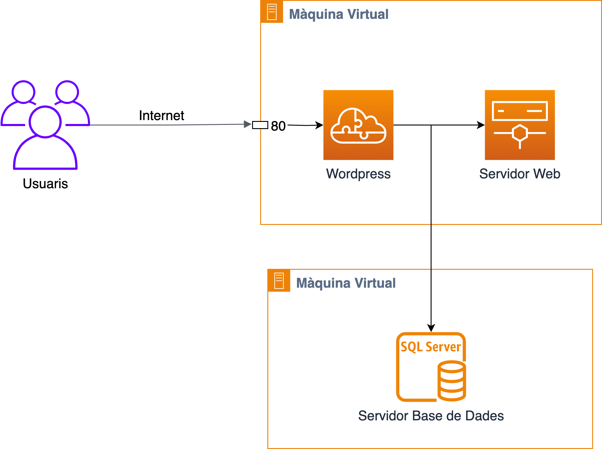

# Reptes

* Reviseu com es pot modificar l’hostname de la màquina virtual i actualitzeu-lo a asvXX-h00-wp on XX és el vostre identificador d'usuari de la plataforma stormy.

* Heu de separar la lògica. Volem tenir una màquina virtual que actuï com a servidor web (**WordPress**) i una màquina virtual que actuï com a base de dades (**MariaDB**). Heu de documentar tots els passos realitzats.



  * **Disseny 1**: Creació de 2 màquines virtuals noves. (Màxim un 8)

  * **Disseny 2**: Migració de la configuració actual. (Via per l'excel·lent)
  
    * Iniciarem una nova màquina virtual que utilitzareu únicament per desplegar la base de dades.
    * Exportar la Base de Dades a un fitxer:
    
    ```sh
      mysqldump -u usuari -p nom_de_la_base_de_dades > backup.sql
    ```

    * Transfereix el fitxer a la nova màquina virtual, per exemple:
    
    ```
    scp backup.sql usuari_desti@ip_del_servidor_desti:/ruta_desti/
    ```

    * Importa la base de dades actual a la nova màquina.

    ```sh
    mysql -u usuari -p nom_de_la_base_de_dades < /ruta_desti/backup.sql
    ```

    * Reviseu la configuració del usuari i els seus permissos a MySQL. Ara volem accedir remotament.

    * Configurareu el wordpress per utilitzar la base de dades remota, reviseu la configuració del fitxer *wp-config.php*.

Presenteu una pull-request al repositori amb la vostra solució als reptes si voleu tenir un nota superior al 5 en aquest **Handson**.
