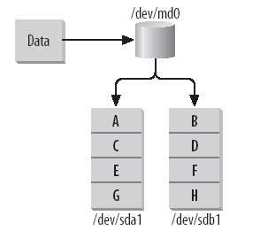
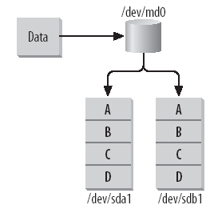
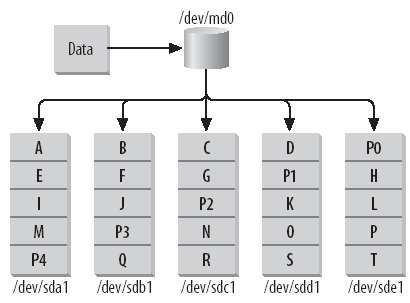

# RAIDs

Un **RAID** és un acrònim que significa *Redundant Array of Independent Disks* (Conjunt Redundant d'Unitats Independents). El seu objectiu és protegir les dades en cas de fallades (redundància) o millorar la velocitat de lectura (rendiment). Consisteix en crear un volum únic amb diversos discos per aconseguir **redundància** (tolerància a falles en cas que un disc falli, conegut com a *disc mirroring*) o **major velocitat** (conegut com a *disc striping*).

Perquè un sistema RAID funcioni, és necessària la presència d'una controladora **RAID** (ja sigui per *software* o per *hardware*).

**OBSERVACIÓ**: Avui en dia, la gran majoria de les controladores **RAID** venen integrades a la BIOS de la placa base, i de fet les controladores per maquinari es fan servir en entorns empresarials més específics.

## Nivells de RAID

Hi ha diversos nivells de RAID, cadascun amb les seves pròpies característiques i avantatges. Aquí en destaquem alguns dels més comuns:

### RAID 0

El **RAID 0** proporciona major velocitat al sistema. La informació es va escrivint en dos discos de manera alternada, és a dir, un bit en un disc i un altre bit en un altre, de manera que l'amplada de banda és el doble, millorant així el rendiment. No ofereix redundància, de manera que si falla un dels dos discs, tota la informació es perd.



### RAID 1

En un **RAID 1**, les dades s'escriuen simultàniament en dos discos, sent un una còpia exacta de l'altre (**mirroring**). Això proporciona una còpia de seguretat en cas que un dels discs falli. **No es guanya rendiment amb aquest tipus de RAID**, ja que totes les dades s'han d'escriure dues vegades.



**Observació 1**: Ens proporciona lectures de dades molt més ràpides (gairebé el doble), ja que es poden llegir les dades de qualsevol disc, el que augmenta la taxa de lectura total.

**Observació 2**: Pel que fa a les escriptures, com que les dades s'han d'escriure en tots els discs, la velocitat d'escriptura és com la d'un disc únic.

### RAID 5

El **RAID 5** permet tenir almenys tres discs durs i només un d'ells s'utilitza com a còpia de seguretat. Augmenta el rendiment de lectura del volum, multiplicant-lo pel nombre de discs menys un que conformen el RAID. Té tolerància a falles d'un disc: si un disc falla, les dades es mantenen intactes i només cal canviar el disc defectuós. No obstant això, si fallen més d'un disc simultàniament, es perdrien dades.



* **Discs**:  Cada disc conté una part de les dades i una part de la paritat.

* **Stripe**: Les dades es divideixen *stripes* de mida fixa (normalment en blocs de dades). Aquests *stripes* s'escriuen en els discs del RAID de manera rotativa. Observey a la imatge amb les lletres A,B,C,D,...

* **Paritat**: Es calcula un valor de paritat per a cada stripe. La paritat és una operació XOR  entre tots els bits de les dades en una mateixa posició de cada disc. Aquest valor de paritat s'emmagatzema en un altre disc del RAID. Observeu a la imatge amb la lletra (P1) corrseponent a la paritat del disc **/dev/sdb1**.

    $$P_{(/dev/sdb1)} = D_{(/dev/sda1)} \oplus D_{(/dev/sdc1)} \oplus D_{(/dev/sdd1)} \oplus D_{(/dev/sde1)}$$
    $$D_{(/dev/sda1)} = (A+E+I+M)$$
    $$D_{(/dev/sdc1)} = (C+G+N+R)$$
    $$D_{(/dev/sdd1)} = (D+K+O+S)$$
    $$D_{(/dev/sde1)} = (H+L+P+T)$$

* **Distribució de les dades**: Els *stripes* de dades i paritat es distribueixen entre els discs del RAID. Cada disc conté dades i paritat de les altres tires.

* **Tolerància a fallades**: Si un disc falla, les dades es poden recuperar a partir de les dades i la paritat emmagatzemades en els altres discs. El disc fallat es pot substituir per un de nou i les dades es poden reconstruir. Imagina't que **/dev/sda1** falla, les seves dades podran ser reconstruides de la següent manera (P1 es troba a **/dev/sdd1**):

    $$\text{Dades de } /dev/sdb1 = P_{(/dev/sdb1)} \oplus D_{(/dev/sda1)} \oplus D_{(/dev/sdc1)} \oplus D_{(/dev/sdd1)} \oplus D_{(/dev/sde1)}$$
    $$D_{(/dev/sda1)} = (A+E+I+M)$$
    $$D_{(/dev/sdc1)} = (C+G+N+R)$$
    $$D_{(/dev/sdd1)} = (D+K+O+S)$$
    $$D_{(/dev/sde1)} = (H+L+P+T)$$

* **Rendiment**: El RAID 5 ofereix un bon rendiment en termes de velocitat de lectura i escriptura, ja que es poden fer múltiples lectures simultànies dels diferents *stripes*. No obstant això, l'escriptura pot ser més lenta que en altres tipus de RAID degut al càlcul de la paritat.

**OBSERVACIÓ**: La paritat només s'utilitza per a l'arrencada en les operacions de lectura. En les operacions d'escriptura, la paritat es recalcula i s'escriu en la seva posició corresponent.

Si **/dev/sdb1** falla es pot reconstruir:

## Instal·lació a Rocky Linux

Per poder utilitzar les RAIDs hem d'instal·lar el següent paquet a Rocky Linux 8:

```sh
dnf search mdadm
Failed to set locale, defaulting to C.UTF-8
Last metadata expiration check: 3:04:59 ago on Fri Sep 29 05:48:33 2023.
================================= Name & Summary Matched: mdadm ==================================
mdadm.x86_64 : The mdadm program controls Linux md devices (software RAID arrays)
```

Per tant:

```sh
dnf install mdadm -y
``````

## Operacions i Gestió de RAIDs

### Creació d'un RAID

```sh
mdadm --create /
 --verbose /dev/[ RAID array Name or Number] /
 --level=[RAID Level] /
 --raid-devices=[Number of storage devices] /
 [Storage Device] [Storage Device]
```

* **create**:  crear un nou dispositiu md (RAID).
* **verbose**: Veure informació en temps real.
* **/dev/[]**: Nom i ubicació de la matriu RAID.
* **level=[]**: Nivell RAID que es vol crear.
* **raid-devices = []**: Especificar el nombre de dispositius o particions d'emmagatzematge que volem utilitzar en aquest dispositiu.
* **Storage Device**: Especificar el nom i la ubicació del dispositiu d'emmagatzematge.

### Ampliació d'un RAID

Es possible augmentar el nombre de discs en un RAID. Imagina't un RAID 5 format per 3 disc físics, però al cap d'un any pots comprar 2 discs extra i poder seguir utilitzant el teu RAID.

La comanda ```mdadm --grow``` et permet dur a terme aquesta acció:

```sh
mdadm --grow /dev/[RAID_name] --raid-devices=[nou_nombre_de_discs] 
```

* */dev/[RAID_name]*: és el nom del teu RAID.
* *[nou_nombre_de_discs]*: és el nou nombre de discs que vols utilitzar en el RAID.

Per exemple, si vols augmentar el nombre de discs en un RAID 5 anomenat /dev/md1 a quatre discs, la comanda seria:

```sh
mdadm --grow /dev/md1 --raid-devices=4
```

Aquesta comanda indicarà a mdadm que vols augmentar el nombre de discs en el RAID a quatre, i intentarà reconfigurar el RAID amb el nou nombre de discs. És important tenir en compte que aquesta operació té algunes limitacions i requereix certa prudència i preparació, especialment si es tracta d'un RAID amb dades importants. Abans de fer aquest tipus de canvis, és **recomanable fer una còpia de seguretat de les dades**.

### Substitució d'un disc defectuós

Per substituir un disc defectuós en un RAID, utilitza la següent comanda ```mdadm --manage --replace```:

```sh
mdadm --manage /dev/[RAID_name] --replace [disc_defectuós] --with [nou_disc]
```

* */dev/[RAID_name]*: és el nom del teu RAID.
* *[disc_defectuós]*: és el disc que vols substituir.
* *[nou_disc]*: és el nou disc que vols afegir com a reemplaçament.

Per exemple, si vols substituir un disc defectuós **/dev/sdb** en el RAID **/dev/md0** amb un nou disc **/dev/sdc**, la comanda seria:

```sh
mdadm --manage /dev/md0 --replace /dev/sdb --with /dev/sdc
```

### Eliminació d'un RAID

Per eliminar un RAID, pots utilitzar la comanda ```mdadm --stop```:

```sh
mdadm --stop /dev/[RAID_name]
```

On */dev/[RAID_name]* és el nom del teu RAID.

**OBSERVACIÓ**: Per eliminar un RAID primer heu de desmuntar-lo. ```umount [RAID_name]```

### Obtenir informació

Per obtenir informació detallada sobre un RAID, utilitza la comanda ```mdadm --detail```:

```sh
mdadm --detail /dev/[RAID_name]
```

On */dev/[RAID_name]* és el nom del teu RAID.

### Afegir un disc de recanvi

Per afegir un disc de recanvi a un RAID, utilitza la comanda ```mdadm --manage``` --add:

```sh
mdadm --manage /dev/[RAID_name] --add [disc_de_recanvi]
```

* /dev/[RAID_name] és el nom del teu RAID.
* [disc_de_recanvi] és el disc que vols afegir com a recanvi.

Per exemple, si vols afegir un disc de recanvi **/dev/sdd** al RAID **/dev/md1**, la comanda seria:

```sh
mdadm --manage /dev/md1 --add /dev/sdd
```

### Eliminar un disc

Per eliminar un disc d'un RAID, pots utilitzar la comanda mdadm ```--manage --remove```:

```sh
mdadm --manage /dev/[RAID_name] --remove [disc_a_eliminar]
```

On:

* */dev/[RAID_name]*: és el nom del teu RAID.
* *[disc_a_eliminar]*: és el disc que vols eliminar del RAID.

**OBSERVACIÓ**: Aquesta comanda retirarà el disc del RAID, redistribuint les dades altra vegada en els altres discs restants. Assegura't de tenir còpies de seguretat per si hi ha algún imprevist.

## Simulant un entorn amb RAIDs

En aquesta simulació, volem crear un entorn amb RAIDs utilitzant un disc virtual de 500MB (**/dev/vdb**). Crearem 4 particions i les formatem amb el sistema de fitxers *xfs*. Farem servir 2 particions per crear un *RAID1*, la tercera partició com a *partició de recanvi* i la quarta per afegir-la en calent.

**Nota 1**: Assegureu-vos d'afegir i muntar el disc a la màquina virtual on fareu la simulació.

**Nota 2**: Utilitzarem particions primaries, però es podrien fer servir extended sense cap problema. Si en algun moment us demano més de 4 particions, podeu fer servir extended.

### Pas 1: Creació de les particions

Utilitzarem ```fdisk``` per crear les particions al disc virtual **/dev/vdb**.

```sh
fdisk /dev/vdb
    Ordre (m per a obtenir ajuda): n
    Partition type:
    p   primary (0 primary, 0 extended, 4 free)
    e   extended
    Select (default p): p
    Nombre de partició (1-4, default 1): 1
    Primera sector (2048-1023999, valor per defecte 2048):
    S'està utilitzant el valor per defecte 2048
    Last sector, +sectors or +size{K,M,G} (2048-1023999,
    valor per defecte 1023999): +100MB
    Partition 1 of type Linux and of size 95 MiB is set
    Ordre (m per a obtenir ajuda): t
    Nombre de partició (1-4, default 1): 1
    Hex code (type L to list all codes): fd
    Changed type of partition 'Linux' to 'Linux raid autodetect'
```

Dins de l'entorn de fdisk, seguirem aquestes passes per a cada partició:

1. Presiona **n** per crear una nova partició.
2. Escull l'opció **p** per indicar que serà una partició primària.
3. Assigna el número de partició (de 1 a 4, o següent disponible).
4. Defineix el primer sector (utilitza el valor per defecte prement *Enter*).
5. Defineix l'últim sector (per exemple, **+100MB** per a una partició de 100MB).
6. Assigna el tipus **fd** per a "Linux RAID autodetect".
7. Repeteix aquest procés per a les altres particions fins a completar les 4.

Després de crear les particions, verifica la taula de particions utilitzant:

```sh
Command (m for help): p
Disk /dev/vdb: 500 MiB, 524288000 bytes, 1024000 sectors
Units: sectors of 1 * 512 = 512 bytes
Sector size (logical/physical): 512 bytes / 512 bytes
I/O size (minimum/optimal): 512 bytes / 512 bytes
Disklabel type: dos
Disk identifier: 0xa312f958

Device     Boot  Start    End Sectors Size Id Type
/dev/vdb1         2048 196607  194560  95M fd Linux raid autodetect
/dev/vdb2       196608 391167  194560  95M fd Linux raid autodetect
/dev/vdb3       391168 585727  194560  95M fd Linux raid autodetect
/dev/vdb4       585728 780287  194560  95M fd Linux raid autodetect
```

Assegura't que la taula de particions reflecteixi les particions que has creat i guarda els canvis amb:

```sh
Command (m for help): w
The partition table has been altered.
Calling ioctl() to re-read partition table.
Syncing disks.
```

### Pas 2: Creació del RAID 1

Ara crearem un RAID1 (**/dev/md1**) amb les dues particions configurades (**/dev/vdb2**) i (**/dev/vdb4**).

```sh
mdadm --create --verbose /dev/md1 --level=1 --raid-devices=2 /dev/vdb2 /dev/vdb4
```

```shell
mdadm: Note: this array has metadata at the start and
    may not be suitable as a boot device.  If you plan to
    store '/boot' on this device please ensure that
    your boot-loader understands md/v1.x metadata, or use
    --metadata=0.90
mdadm: size set to 96256K
Continue creating array?
```

Aquesta advertencia ens indica que les metadades estan configurades com a **md/v1.x**, i aquest tipus de metadades no és el més adequat per a un dispositiu d'arrencada (boot device). Aquest tipus de metadades poden no ser compatibles amb alguns carregadors d'arrencada (boot loaders). Si la nostra RAID fos per /boot llavors necessitariam ```mdadm --create --verbose /dev/md1 --level=1 --metadata=0.90 --raid-devices=2 /dev/vdb2 /dev/vdb4```. Però com no és el cas podem ometre aquest **warning**.

```shell
Continue creating array? yes
mdadm: Defaulting to version 1.2 metadata
mdadm: array /dev/md1 started.
```

### Pas 3: Creació del sistema de fitxers i muntatge

Per crear el sistema de fitxers hem decidit utilitzar *xfs* i el muntarem en el directori */mnt/data*.

```sh
mkfs -t xfs /dev/md1
```

```shell
meta-data=/dev/md1               isize=512    agcount=4, agsize=6016 blks
         =                       sectsz=512   attr=2, projid32bit=1
         =                       crc=1        finobt=1, sparse=1, rmapbt=0
         =                       reflink=1
data     =                       bsize=4096   blocks=24064, imaxpct=25
         =                       sunit=0      swidth=0 blks
naming   =version 2              bsize=4096   ascii-ci=0, ftype=1
log      =internal log           bsize=4096   blocks=1368, version=2
         =                       sectsz=512   sunit=0 blks, lazy-count=1
realtime =none                   extsz=4096   blocks=0, rtextents=0
```

```sh
mkdir /mnt/data
mount /dev/md1 /mnt/data
```

Comproveu que teni el RAID montant amb:

```sh
df -h
```

```shell
Filesystem      Size  Used Avail Use% Mounted on
devtmpfs        469M     0  469M   0% /dev
tmpfs           485M     0  485M   0% /dev/shm
tmpfs           485M  6.5M  479M   2% /run
tmpfs           485M     0  485M   0% /sys/fs/cgroup
/dev/vda1       4.0G  1.2G  2.9G  30% /
tmpfs            97M     0   97M   0% /run/user/0
/dev/md1         89M  5.6M   84M   7% /mnt/data
```

Obteniu els detalls amb:

```sh
mdadm --detail /dev/md1
```

```shell
/dev/md1:
           Version : 1.2
     Creation Time : Fri Sep 29 09:00:57 2023
        Raid Level : raid1
        Array Size : 96256 (94.00 MiB 98.57 MB)
     Used Dev Size : 96256 (94.00 MiB 98.57 MB)
      Raid Devices : 2
     Total Devices : 2
       Persistence : Superblock is persistent

       Update Time : Fri Sep 29 09:03:11 2023
             State : clean
    Active Devices : 2
   Working Devices : 2
    Failed Devices : 0
     Spare Devices : 0

Consistency Policy : resync

              Name : localhost.localdomain:1  (local to host localhost.localdomain)
              UUID : 0b84e460:a1ffe052:ad37914f:dceb674f
            Events : 17

    Number   Major   Minor   RaidDevice State
       0     252       18        0      active sync   /dev/vdb2
       1     252       20        1      active sync   /dev/vdb4
```

### Pas 3: Utilitzant la RAID

En primer lloc accedirem al directori de la RAID:

```sh
cd /mnt/data
```

i crearem alguns fitxers i directoris:

```sh
echo "Contingut de l'arxiu 1" > arxiu1.txt
echo "Contingut de l'arxiu 2" > arxiu2.txt
fallocate -l 30M arxiu3.txt
```

per comprovar l'ús podem fer servir **du**:

```sh
du -h
```

```shell
31M .
```

```sh
df -h
```

```shell
Filesystem      Size  Used Avail Use% Mounted on
devtmpfs        469M     0  469M   0% /dev
tmpfs           485M     0  485M   0% /dev/shm
tmpfs           485M  6.5M  479M   2% /run
tmpfs           485M     0  485M   0% /sys/fs/cgroup
/dev/vda1       4.0G  1.2G  2.9G  30% /
tmpfs            97M     0   97M   0% /run/user/0
/dev/md1         89M   36M   54M  41% /mnt/data
```

Ara simulem una fallada en una de les particions i mostrem com el RAID1 manté la disponibilitat de les dades.

1. Marca una partició com a fallit (simulant fallada)

    ```sh
    mdadm --manage --set-faulty /dev/md1 /dev/vdb2
    ```

    ```shell
    mdadm: set /dev/vdb2 faulty in /dev/md1
    ```

2. Mostra l'estat del RAID després de la fallada

    ```sh
    cat /proc/mdstat
    ```

    ```shell
    Personalities : [raid1]
    md1 : active raid1 vdb4[1] vdb2[0](F)
        96256 blocks super 1.2 [2/1] [_U]

    unused devices: <none>
    ```

3. Comprovem el contingut de la RAID i observarem que els fitxers s'han mantingut intactes:

    ```sh
    ls -la /mnt/data
    ```

    ```shell
    total 30728
    drwxr-xr-x. 2 root root       60 Sep 29 09:10 .
    drwxr-xr-x. 3 root root       18 Sep 29 09:03 ..
    -rw-r--r--. 1 root root       23 Sep 29 09:10 arxiu1.txt
    -rw-r--r--. 1 root root       23 Sep 29 09:10 arxiu2.txt
    -rw-r--r--. 1 root root 31457280 Sep 29 09:10 arxiu3.txt
    ```

4. També ens permet seguir treballant:

    ```sh
    dd if=/dev/zero of=arxiu4 bs=1024 count=20k
    ```

    ```shell
    20480+0 records in
    20480+0 records out
    20971520 bytes (21 MB, 20 MiB) copied, 0.222526 s, 94.2 MB/s
    ```

5. Comprovem el contingut de la RAID:

    ```sh
    ls -la /mnt/data
    ```

    ```shell
    total 51208
    drwxr-xr-x. 2 root root       74 Sep 29 09:18 .
    drwxr-xr-x. 3 root root       18 Sep 29 09:03 ..
    -rw-r--r--. 1 root root       23 Sep 29 09:10 arxiu1.txt
    -rw-r--r--. 1 root root       23 Sep 29 09:10 arxiu2.txt
    -rw-r--r--. 1 root root 31457280 Sep 29 09:10 arxiu3.txt
    -rw-r--r--. 1 root root 20971520 Sep 29 09:18 arxiu4
    ```

### Pas 4: Reparació de la partició fallida

1. Marcarem la partició com activa:

    ```sh
    mdadm --manage --re-add /dev/md1 /dev/vdb2
    ```

    ```shell
    mdadm: re-add /dev/vdb2 to md1 succeed
    ```

    ```sh
    cat /proc/mdstat
    ```

    ```shell
    Personalities : [raid1]
    md1 : active raid1 vdb4[1] vdb2[0]
        96256 blocks super 1.2 [2/2] [UU]

    unused devices: <none>
    ```

2. Afegirem una partició de reserva (**/dev/vdb1**):

    ```sh
    mdadm --manage /dev/md1 --add /dev/vdb1
    ```

    ```shell
    mdadm: added /dev/vdb1
    ```

    ```sh
    cat /proc/mdstat
    ```

    ```shell
    Personalities : [raid1]
    md1 : active raid1 vdb1[2](S) vdb4[1] vdb2[0]
        96256 blocks super 1.2 [2/2] [UU]

    unused devices: <none>
    ```

    ```sh
    mdadm --detail /dev/md1
    ```

    ```shell
    /dev/md1:
           Version : 1.2
     Creation Time : Fri Sep 29 09:00:57 2023
        Raid Level : raid1
        Array Size : 96256 (94.00 MiB 98.57 MB)
     Used Dev Size : 96256 (94.00 MiB 98.57 MB)
      Raid Devices : 2
     Total Devices : 3
       Persistence : Superblock is persistent

       Update Time : Fri Sep 29 09:26:14 2023
             State : clean
    Active Devices : 2
   Working Devices : 3
    Failed Devices : 0
     Spare Devices : 1

    Consistency Policy : resync

        Name : localhost.localdomain:1  (local to host localhost.localdomain)
        UUID : 0b84e460:a1ffe052:ad37914f:dceb674f
        Events : 36

    Number   Major   Minor   RaidDevice State
    0     252       18        0      active sync   /dev/vdb2
    1     252       20        1      active sync   /dev/vdb4

    2     252       17        -      spare   /dev/vdb1
    ```

3. Ara farem fallar **/dev/vdb4**:

    ```sh
    mdadm --manage --set-faulty /dev/md1 /dev/vdb4
    ```

    ```shell
    mdadm: set /dev/vdb4 faulty in /dev/md1
    ```

    ```sh
    mdadm --detail /dev/md1
    ```

    ```shell
    /dev/md1:
           Version : 1.2
     Creation Time : Fri Sep 29 09:00:57 2023
        Raid Level : raid1
        Array Size : 96256 (94.00 MiB 98.57 MB)
     Used Dev Size : 96256 (94.00 MiB 98.57 MB)
      Raid Devices : 2
     Total Devices : 3
       Persistence : Superblock is persistent

       Update Time : Fri Sep 29 09:30:03 2023
             State : clean, degraded, recovering
    Active Devices : 1
   Working Devices : 2
    Failed Devices : 1
     Spare Devices : 1

    Consistency Policy : resync

    Rebuild Status : 94% complete

        Name : localhost.localdomain:1  (local to host localhost.localdomain)
        UUID : 0b84e460:a1ffe052:ad37914f:dceb674f
        Events : 52

    Number   Major   Minor   RaidDevice State
       0     252       18        0      active sync   /dev/vdb2
       2     252       17        1      spare rebuilding   /dev/vdb1
       1     252       20        -      faulty   /dev/vdb4
    ```

De forma automatica el RAID és recontrueix amb el disc **/dev/vdb1** passat uns moments tornarem a tenir el RAID reconstruït i funcial.

**Observeu**: Si intenteu anar afegint fitxers al RAID el plenareu i obtindreu el missatge de: **No space left on device**.

### Pas 5: Muntar la RAID de forma persistent

Si reinicieu el sistema amb ```reboot``` observareu que la RAID ja no es troba muntada a **/mnt/data**. Per configurar la RAID de forma persistent necessitem editar **/etc/fstab**.

```sh
# No executeu aquesta comanda (seguir llegint...)
echo "/dev/md1 /mnt/data xfs defaults 0 0" >> "/etc/fstab"
```

**Observació**: Es molt important utilitzar els **UUID** i no els noms dels dispositius (**/dev/md1**). Per tant:

```sh
blkid
```

```shell
/dev/vda1: UUID="3e819c68-f398-4b7d-ad69-a9549917d0d3" BLOCK_SIZE="512" TYPE="xfs" PARTUUID="3af8e3c2-01"
/dev/sr0: BLOCK_SIZE="2048" UUID="2023-09-19-00-38-23-00" LABEL="CONTEXT" TYPE="iso9660"
/dev/vdb1: UUID="0b84e460-a1ff-e052-ad37-914fdceb674f" UUID_SUB="32793711-defa-790c-4b9d-44b98df2237a" LABEL="localhost.localdomain:1" TYPE="linux_raid_member" PARTUUID="a312f958-01"
/dev/vdb2: UUID="0b84e460-a1ff-e052-ad37-914fdceb674f" UUID_SUB="052be034-127f-4990-ed50-33507cebc5a8" LABEL="localhost.localdomain:1" TYPE="linux_raid_member" PARTUUID="a312f958-02"
/dev/vdb3: PARTUUID="a312f958-03"
/dev/vdb4: UUID="0b84e460-a1ff-e052-ad37-914fdceb674f" UUID_SUB="7c48956f-517f-8121-088e-7bd217a6067a" LABEL="localhost.localdomain:1" TYPE="linux_raid_member" PARTUUID="a312f958-04"
/dev/md1: UUID="7029d8bc-4819-46ce-9c81-86c77a6a532b" BLOCK_SIZE="512" TYPE="xfs"
```

```sh
# Modifiqueu el UUID amb el valor corresponen de /dev/md1 en la vostra màquina
echo "UUID=7029d8bc-4819-46ce-9c81-86c77a6a532b /mnt/data xfs defaults 0 0" >> /etc/fstab
```

Un cop fet podem desmontar el RAID i remuntar-lo fent una recàrrega del fitxer:

```sh
umount /mnt/data
mount -a 
```

### Solució de problemes

Es possible que experimentant us surti:

```shell
mount: /mnt/data: wrong fs type, bad option, bad superblock on /dev/md1, missing codepage or helper program, or other error.
```

Podeu utilitzar:

```sh
xfs_repair -L /dev/md1
```

```shell
Phase 1 - find and verify superblock...
Phase 2 - using internal log
        - zero log...
ALERT: The filesystem has valuable metadata changes in a log which is being
destroyed because the -L option was used.
        - scan filesystem freespace and inode maps...
sb_fdblocks 9862, counted 14982
        - found root inode chunk
Phase 3 - for each AG...
        - scan and clear agi unlinked lists...
        - process known inodes and perform inode discovery...
        - agno = 0
data fork in ino 134 claims free block 24
data fork in ino 134 claims free block 25
        - agno = 1
        - agno = 2
        - agno = 3
        - process newly discovered inodes...
Phase 4 - check for duplicate blocks...
        - setting up duplicate extent list...
        - check for inodes claiming duplicate blocks...
        - agno = 0
        - agno = 1
        - agno = 2
        - agno = 3
Phase 5 - rebuild AG headers and trees...
        - reset superblock...
Phase 6 - check inode connectivity...
        - resetting contents of realtime bitmap and summary inodes
        - traversing filesystem ...
        - traversal finished ...
        - moving disconnected inodes to lost+found ...
Phase 7 - verify and correct link counts...
Maximum metadata LSN (1:63) is ahead of log (1:2).
Format log to cycle 4.
done
```

### Pas 6: Eliminar un RAID

1. Per eliminar un RAID el primer pas és desmontar-lo.

    ```sh
    umount /dev/md1  
    ```

2. Eliminem el RAID:

    ```sh
    mdadm --stop /dev/md1 
    ```

    ```shell
    mdadm: stopped /dev/md1
    ```

3. Recordeu d'eliminar l'entrada del fitxer **/etc/fstab**:

    ```sh
    # Modifiqueu el UUID pel vostre
    sed -i '/7029d8bc-4819-46ce-9c81-86c77a6a532b*/d' /etc/fsta
    ```

4. Es recomanable eliminar les dades de les particions utilitzades:

    ```sh
    dd if=/dev/zero of=/dev/vb1 count=10 bs=1M
    dd if=/dev/zero of=/dev/vb2 count=10 bs=1M
    dd if=/dev/zero of=/dev/vb4 count=10 bs=1M
    ```
