# Sistema de fitxers

El sistema de fitxers és l'estructura que utilitza un sistema operatiu per *organitzar i emmagatzemar informació en el disc*. Aquest sistema defineix com es guarden i s'accedeixen als fitxers i directoris en el sistema operatiu.

- **Fitxers**: Un fitxer és una col·lecció d'informació que es guarda en el disc. Pot contenir text, dades binàries, codi executable, entre altres tipus d'informació.
  
- **Directoris**: Els directoris són utilitzats per organitzar els fitxers en grups lògics. Cada fitxer es troba en un directori específic, i els directoris poden contenir altres directoris o fitxers.
  
- **Fitxers especials**: A més dels fitxers i directoris regulars, hi ha altres tipus de fitxers especials que representen dispositius connectats al sistema. Poden ser de caràcters o de blocs, depenent del tipus de dispositiu.

La comanda ```lsblk``` ens permet veure una llista de tots els dispositius de blocs del sistema, com ara discos i particions. Aquesta comanda ens mostra el nom del dispositiu, la seva mida, el tipus de dispositiu i el punt de muntatge associat.

```bash
lsblk
```

```shell
NAME   MAJ:MIN RM  SIZE RO TYPE MOUNTPOINTS
NAME   MAJ:MIN RM  SIZE RO TYPE MOUNTPOINT
sr0     11:0    1  364K  0 rom
vda    252:0    0    4G  0 disk
`-vda1 252:1    0    4G  0 part /
```

Es pot observar un disc (**vda**) amb 1 particions (**vda1**) i un dispositiu rom (**sr0**). Aquest dispositiu rom és un dispositiu de lectura de CD/DVD.

Cada *disc o partició* té el seu propi sistema de fitxers. Pots utilitzar la comanda `df -h` per veure una llista de les particions i els seus sistemes de fitxers associats, així com la informació d'ús d'espai en disc.

```bash
df -h
```

```shell
Filesystem      Size  Used Avail Use% Mounted on
devtmpfs        469M   30M  439M   7% /dev
tmpfs           485M     0  485M   0% /dev/shm
tmpfs           485M   13M  473M   3% /run
tmpfs           485M     0  485M   0% /sys/fs/cgroup
/dev/vda1       4.0G  1.2G  2.9G  30% /
tmpfs            97M     0   97M   0% /run/user/0
```

En aquest exemple, podem veure que hi ha una particion amb sistemes de fitxers associats: **/dev/vda1** és la partició del disc que té un sistema de fitxers associat i està muntat com a directori arrel **(/)**. Té una mida total de **4G**, amb **1,2G** utilitzats i **2.9G** lliures. El % d'ús és del **30%**. *Aquesta partició conté el sistema operatiu Rocky Linux*.

Podem observar diferents sistemes de fitxers com *devtmpfs*, *tmpfs*. Aquestes particions són particions virtuals que no tenen un dispositiu físic associat. Aquestes particions virtuals tenen assignades un espai de memòria i són utilitzades pel sistema operatiu per a emmagatzemar informació temporal.

Anem a veure com esta organitzat el sistema de fitxers. A través del sistema de fitxers principal, els usuaris poden gestionar i accedir a la informació emmagatzemada en el disc. És important comprendre l'estructura i el funcionament del sistema de fitxers per a una correcta gestió i organització dels fitxers i directoris en el sistema operatiu.

```sh
dnf install tree -y
```

```sh
cd /
tree -L 1 -d 
```

```shell
.
|-- bin -> usr/bin
|-- boot
|-- dev
|-- etc
|-- home
|-- lib -> usr/lib
|-- lib64 -> usr/lib64
|-- media
|-- mnt
|-- opt
|-- proc
|-- root
|-- run
|-- sbin -> usr/sbin
|-- srv
|-- sys
|-- tmp
|-- usr
`-- var

19 directories
```

| Directori | Contingut                               |
|-----------|-----------------------------------------|
| bin       | Binaris d'ordres essencials              |
| boot      | Fitxers estàtics del carregador de l'arrencada |
| dev       | Fitxers de dispositius                   |
| etc       | Configuració específica de l'amfitrió del sistema |
| home      | Directoris d'inici d'usuari              |
| lib       | Llibreries compartides essencials i mòduls del nucli |
| media     | Punts de muntatge per a mitjans reemplaçables |
| mnt       | Punt de muntatge per muntar un sistema de fitxers temporalment |
| opt       | Paquets de programari addicional         |
| proc      | Directori virtual per a informació del sistema |
| root      | Directori d'inici per a l'usuari root    |
| run       | Dades variables d'execució               |
| sbin      | Binaris essencials del sistema           |
| srv       | Dades per a serveis proporcionats pel sistema |
| sys       | Directori virtual per a informació del sistema |
| tmp       | Fitxers temporals                        |
| usr       | Jerarquia secundària                     |
| var       | Dades variables                          |
| .         | Directori actual                        |
| ..        | Directori anterior                      |

## Superblocs

Cada **sistema de fitxers** té un *superbloc*, una estructura de metadades crítica que emmagatzema informació vital sobre el sistema de fitxers. Aquesta informació inclou:

- **Una zona (cluster)** és la unitat de transferència del sistema de fitxers. Nosaltres suposarem que $$log2(\frac{mida_{zona}}{mida_{bloc}})$$ és igual a 0. És a dir, la mida d’una zona és igual a la mida d’un bloc. Per tant el Mapa de bits de zones (lliures) equival al Mapa de bits de blocs (lliures).
- **El Mapa de bits d’inodes (lliures)** funciona de la mateixa forma que el Mapa de bits de blocs (lliures). Ens indica els inodes lliures i ocupats.
- **El nombre màgic** ens indica el tipus de SF, p.e.: DOS, UNIX, etc.. L’inode arrel del sistema de fitxers muntat equival a l’inode arrel del sistema de fitxers que està muntat en el sistema de fitxers. arrel. Poden haver molts sistema de fitxers. muntats (i.e. altres discs, particions, etc.) en el sistema de fitxers arrel.
- **Mida del bloc**: La grandària del bloc és la unitat bàsica d'alineació per a la informació emmagatzemada al disc.
- **Mida del sistema de fitxers**: Indica la grandària total del sistema de fitxers.
- **Nombres d'inodes**: El nombre total d'inodes disponibles al sistema de fitxers.
- **Inodes per grup**: Nombre d'inodes en cada grup, que és una subdivisió lògica del sistema de fitxers.
- **Primer inode lliure**: L'identificador de l'últim inode utilitzat.

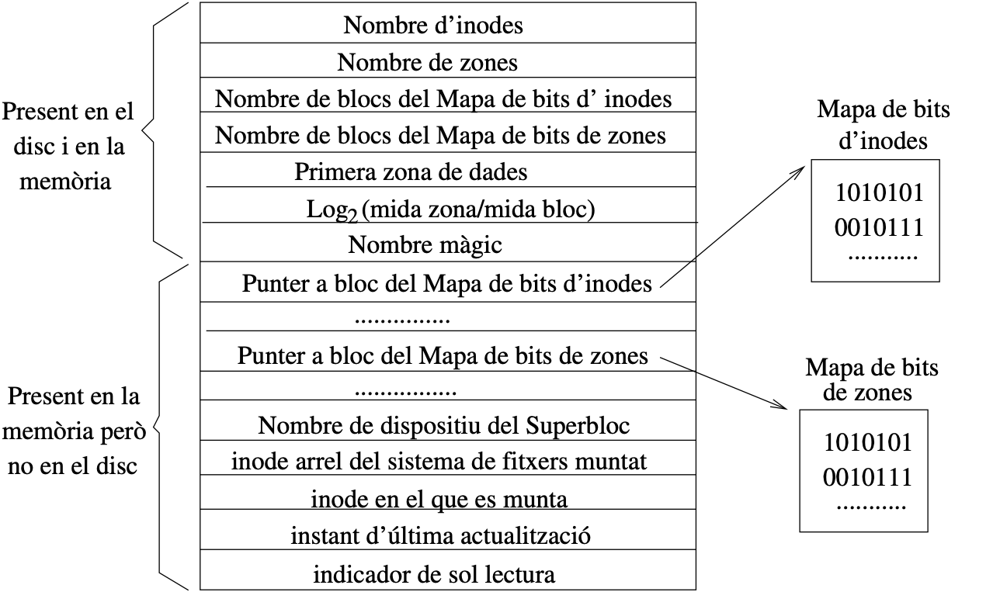

**Observació**: En Memòria hi ha una Taula de Superblocs que serveix per gestionar els diferents SF muntats en el sistema.

Per exemple, en la nostra màquina virtual s'utilitza un sistema de fitxers del tipus **xfs**, per tant podem consultar la seva informació:

```sh
xfs_info /dev/vda1
```

```shell
meta-data=/dev/vda1              isize=512    agcount=4, agsize=262080 blks
         =                       sectsz=512   attr=2, projid32bit=1
         =                       crc=1        finobt=1, sparse=1, rmapbt=0
         =                       reflink=1
data     =                       bsize=4096   blocks=1048320, imaxpct=25
         =                       sunit=0      swidth=0 blks
naming   =version 2              bsize=4096   ascii-ci=0, ftype=1
log      =internal log           bsize=4096   blocks=2560, version=2
         =                       sectsz=512   sunit=0 blks, lazy-count=1
realtime =none                   extsz=4096   blocks=0, rtextents=0
```

## Inodes

Els **inodes** són una estructura de metadades utilitzada pels sistemes de fitxers per emmagatzemar informació sobre els fitxers i directoris. Cada fitxer o directori en un sistema de fitxers té un inode associat.

Les principals característiques dels inodes són:

- **Identificador Únic**: Cada inode té un identificador únic que l'identifica de manera única dins del sistema de fitxers.
- **Metadades del Fitxer**: L'estructura d'un inode emmagatzema metadades importants com el tipus de fitxer, els permisos d'accés, el propietari i el grup, el tamany del fitxer i les timestamps de creació, modificació i accés.
- **Apuntadors a Blocs**: Els inodes contenen apuntadors a blocs de dades que emmagatzemen el contingut real del fitxer.
- **Enllaços Durs i Soft**: El nombre d'enllaços durs i enllaços simbòlics que apunten a un inode determina la seva referència i disponibilitat.

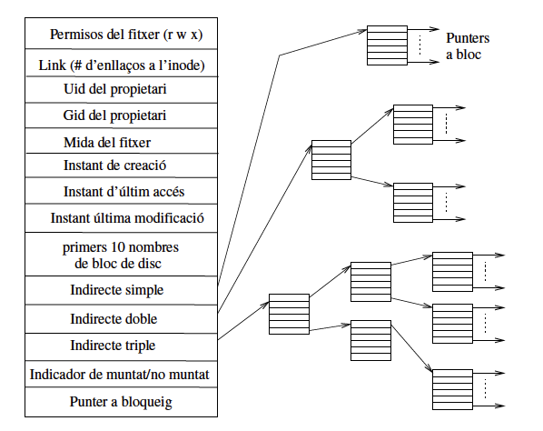

En la figura es pot observar com els inodes guarden tota la informació necessaria per a cercar el bloc de dades associat a un fitxer o directori en el disc físic.

Podem utilitzar la comanda `stat` per veure les metadades d'un fitxer o directori. En aquest exemple, podem veure les metadades del directori */home*.

```bash
jordi@debianlab:~$: stat /home/
     Fitxer: /home/
       Mida: 4096      Blocs: 8          Bloc d’E/S: 4096   directori
Device: 8,2 Inode: 913921      Links: 3
      Accés: (0755/drwxr-xr-x)  UID: (    0/    root)   GID: (    0/    root)
      Accés: 2023-07-11 09:52:31.307443950 +0200
Modificació: 2023-07-07 16:54:09.656731220 +0200
      Canvi: 2023-07-07 16:54:09.656731220 +0200
  Naixement: 2023-07-07 16:34:47.016777227 +0200
```

Els inodes són una part fonamental del sistema de fitxers i proporcionen informació essencial per a l'organització i accés als fitxers i directoris en el sistema operatiu.

## Enllaços

Com heu pogut observar al resultat de la comanda `stat`, el directori */home* té 3 enllaços. Els enllaços són una estructura que permet als fitxers i directoris tenir múltiples noms de ruta. També, heu observat que la sortida de la comanda tree mostra **->** en alguns directoris. Això indica que aquests directoris són enllaços simbòlics. O bé, la comanda **ls -l** també ens mostra la **->** indicant que és un enllaç simbòlic. *Però que són exactament els enllaços?*

Els enllaços són una característica important del sistema de fitxers que permeten als fitxers i directoris tenir múltiples noms de ruta, proporcionant una forma eficient i versàtil d'organitzar i accedir als recursos del sistema. Aquests enllaços poden ser de dos tipus:

- **Enllaç dur**: Un enllaç dur és una entrada de directori que apunta directament a un inode, el qual representa un fitxer o directori. D'aquesta manera, diversos enllaços durs poden apuntar al mateix inode, compartint el mateix contingut. Quan esborrem un enllaç dur, el fitxer es manté en el sistema fins que tots els enllaços durs que apunten a l'inode són eliminats. Els enllaços durs són útils per a situacions on volem mantenir múltiples referències al mateix fitxer sense duplicar-lo físicament. Aquesta característica permet estalviar espai d'emmagatzematge i assegura que els canvis fets a un enllaç dur es reflecteixin a tots els altres enllaços que apunten al mateix inode.

- **Enllaç simbòlic**: Un enllaç simbòlic és una entrada de directori especial que apunta a una ruta de directori o fitxer a través d'un altre inode. A diferència dels enllaços durs, un enllaç simbòlic és simplement un punter a la ruta de destinació, en lloc de compartir el mateix inode amb el fitxer o directori original. Si esborrem un enllaç simbòlic, això no afectarà la ruta de destinació. Els enllaços simbòlics són útils quan volem fer referència a un fitxer o directori en una ubicació diferent o amb un nom més amigable, sense moure físicament el fitxer o alterar la seva ubicació original. Això és particularment útil en situacions en què necessitem accedir a fitxers o directoris des de diversos punts del sistema sense duplicar-los.

](../HandsOn-03/figs/sf/enllaços.png)

En la figura extreta de [lpic1-exam-guide](https://borosan.gitbook.io/lpic1-exam-guide/1046-create-and-change-hard-and-symbolic-links) es pot observar com els enllaços durs i simbòlics són diferents. Els enllaços durs són una referència directa a un inode. Això significa que els enllaços durs i el fitxer original tenen el mateix inode. Els enllaços durs comparteixen el mateix inode i, per tant, comparteixen el mateix contingut. En canvi, els enllaços simbòlics són una referència indirecta a un inode. Això significa que els enllaços simbòlics i el fitxer original tenen diferents inodes. D'aquesta manera, atorguen més flexibilitat i versatilitat en la gestió dels fitxers i directoris.

Per a crear enllaços durs i simbòlics, utilitzarem la comanda `ln`. Aquesta comanda té dos tipus d'ús:

* ```ln f1 f2``` s'utilitza per crear un nou enllaç dur que tingui el nom de ruta f2 per a un fitxer identificat amb el nom de ruta f1.

* ```ln -s f1 f2``` crea un nou enllaç **soft** amb **f2** que fa referència a **f1**.  El sistema de fitxers extreu la part del directori de **f2** i crea una nova entrada en aquest directori de tipus enllaç simbòlic, amb el nom indicat per **f2**. Aquest nou fitxer conté el nom indicat pel nom de ruta **f1**. Cada referència a **f2** es pot traduir automàticament en una referència a **f1**.

Considerem el següent escenari: tens dos fitxers, `fitxer1.txt` i `fitxer2.txt`, al teu directori actual.

```bash
echo "Contingut del fitxer 1" > fitxer1.txt
echo "Contingut del fitxer 2" > fitxer2.txt
ls -i fitxer1.txt fitxer2.txt
ln fitxer2.txt enllac_hard.txt
ln -s fitxer1.txt enllac_soft.txt
ls -i enllac_hard.txt enllac_soft.txt
```

En aquest exemple es mostra la creación de dos fitxers, la visualización dels seus inodes y la creació dels dos tipus d'enllaços. Podem observar com els enllaços durs tenen el mateix inode que el fitxer original, mentre que els enllaços simbòlics tenen un inode diferent.

### Tipus de sistemes de fitxers

- **xfs i ext4**: Sistemes de fitxers tradicionals, on l'administració dels volums i els RAID s'implementen de forma separada al sistema de fitxers. Els sistemes de fitxers s'encarreguen d'emmagatzemar els fitxers en blocs de mida definida.

- **ZFS i Btrfs**: Sistemes de fitxers (Next-gen). Representen enfocaments integrats verticalment per a la gestió d'emmagatzematge que inclouen les funcions d'un gestor de volums lògic i un controlador RAID. Tot i que les versions actuals d’ambdós sistemes tenen algunes limitacions, la majoria cauen en la categoria (encara no implementada) en lloc de la categoria (no es pot fer per motius arquitectònics).

Comparativa de sistemes de fitxer tradicionals. Assumint arquitectura x86 on el max és 4kiB (mida del bloc)

|Límit           |ext3|ext4|XFS|
|------------------|----|----|----|
|max file system size|16TiB|16TiB|16EiB|
|max file size|2TiB|16TiB|8EiB|
|max extent size|4kiB|128MiB|8GiB|
|max extended attribute siz|4kiB|4kiB|64kiB|
|max inode number|$$2^{32}$$|$$2^{32}$$|$$2^{64}$$|

Com a administradors del sistema, tindríem requisits en què hem de configurar els discs  com a part de l’actualització de la capacitat del servidor, per separar els continguts per temes de seguretat o, de vegades, la substitució del disc en cas de fallada.

## Creació de discos virtuals a OpenNebula

1. Anar a *Storage* -> Images.
2. Fer click a (**+**).

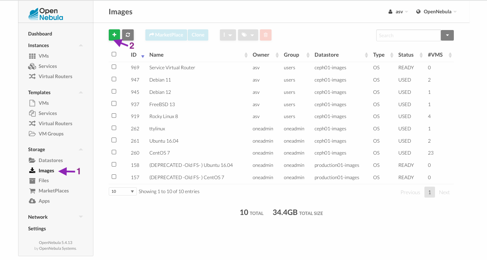

1. Name: *HDD ASV*
2. Type: *Generic storage datablock*
3. Datastore: 115
4. Image location: *Empty disk image*
5. Size: *500 MB*
6. Advanced options:
   - Image mapping drive: *qcow2*
7. Fer clic a **create**.

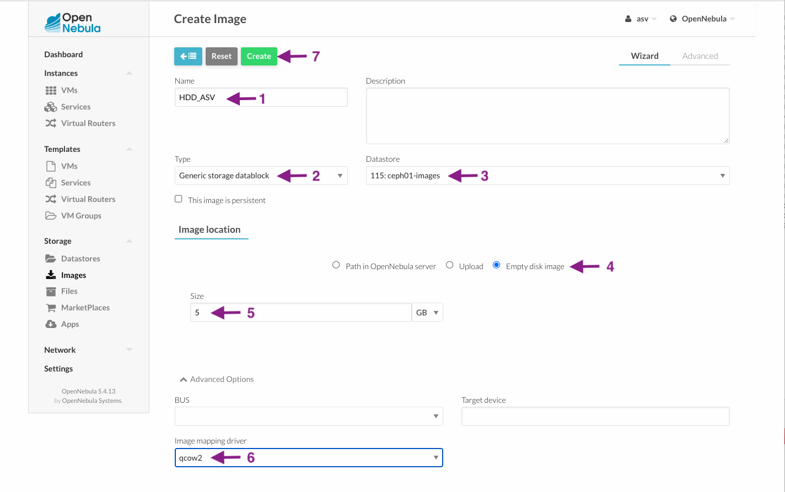

Un cop creat el disc espereu a que **status** sigui **Ready**:

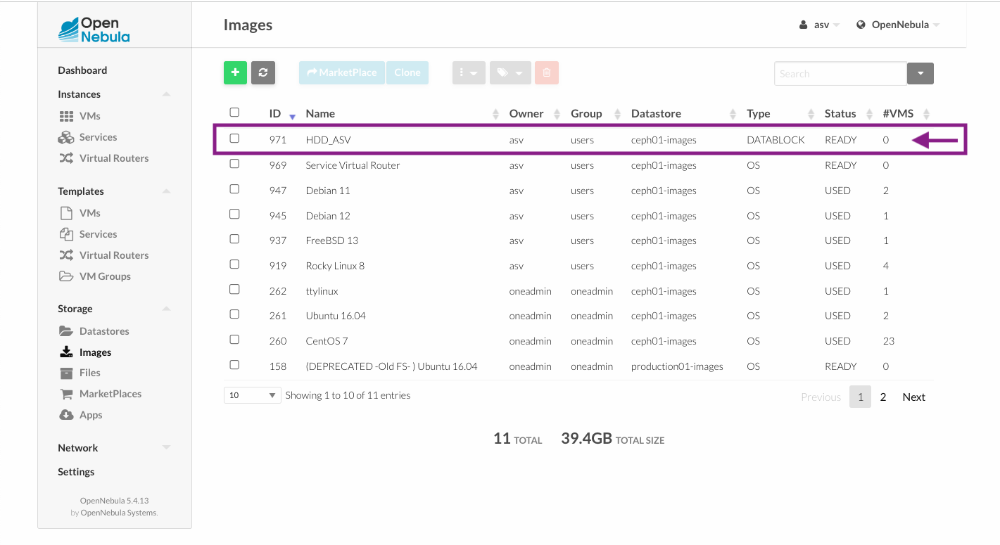

Ara aneu a instancies, VMs, seleccionar una MV (1) -> Storage (2) -> Attach disk (3)

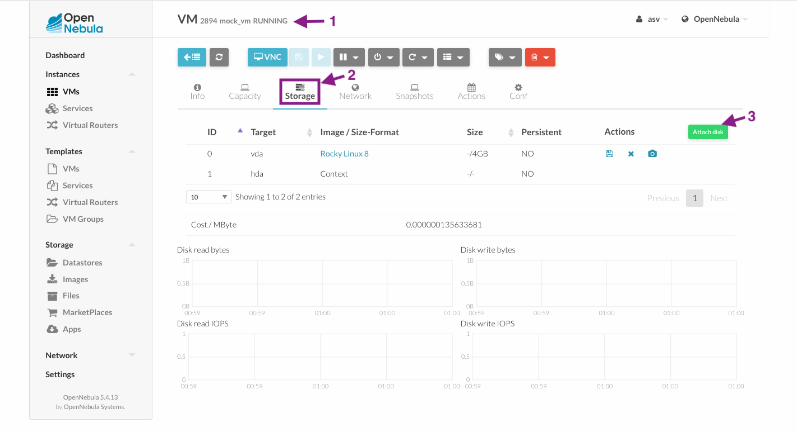

Seleccioneu el disc *HDD ASV* creat.

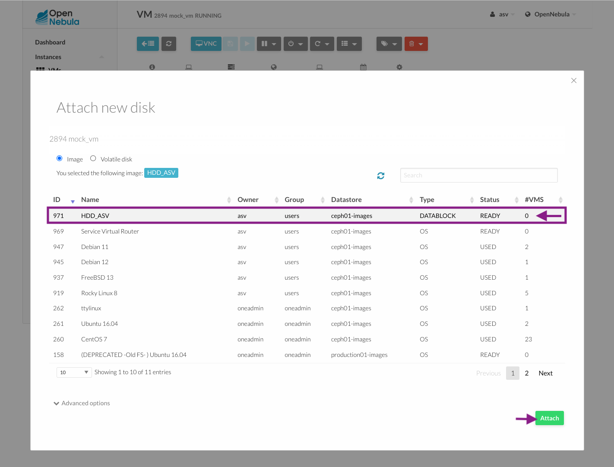

Finalment observeu com la màquina virtual té els dos disc:

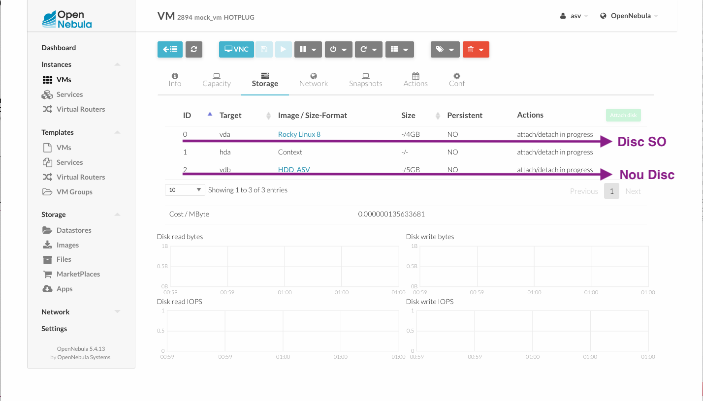

Ara únicament heu d'entrar a la màquina virtual per ssh i formatejarem i muntarem aquest nou disc.

Al entrar a la màquina observem que únicament tenim muntat el disc del sistema operatiu:

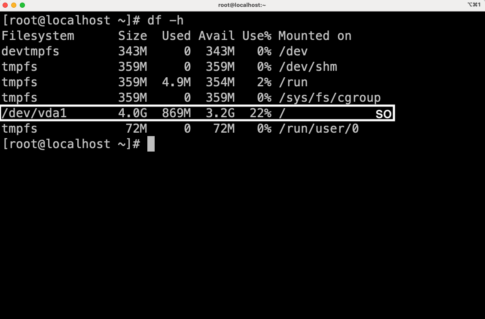

Podeu utilitzar la comanda ```fdisk -l``` per veure els discs i les particions.

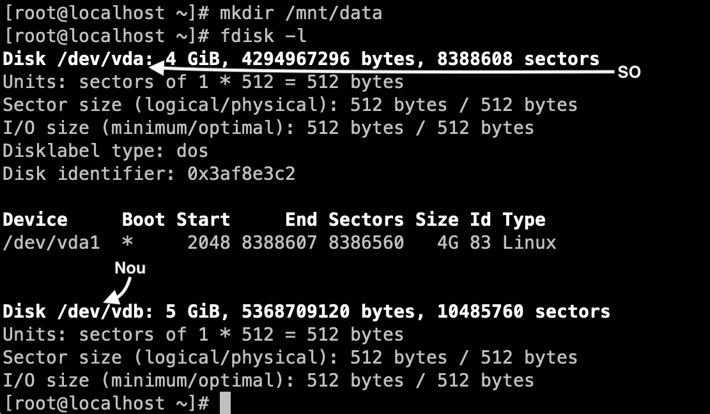

1. Creació d'un punt de muntatge:

      ```sh
      mkdir /mnt/data 
      ```

2. Utilitzare el programa mkfs per crear un sistema de fitxers XFS:

      ```sh
      mkfs.xfs /dev/vdb 
      # vdb és el nou disc, reviseu imatge
      # utilitzeu lblkid per veure els discs
      ```

      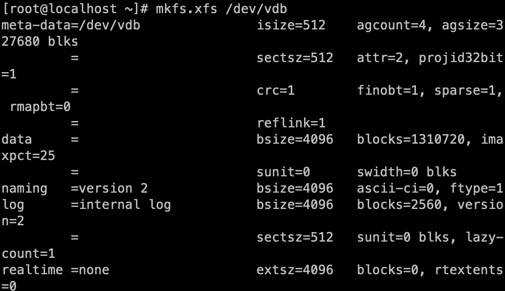

3. Muntar el disc al punt de muntatge:

      ```sh
      mount /dev/vdb /mnt/data/ 
      ```

4. Comprovar que el disc està muntat:

      ```sh
      df -h 
      ```

      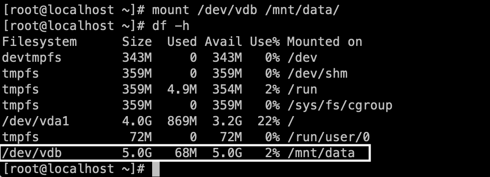

## Comanda *fdisk*

La comanda *fdisk* ens permet veure i configurar els discos i les particions.

```shell
$ fdisk -l
Disk /dev/vda: 8589 MB, 8589934592 bytes, 16777216
...
/dev/vda1   *      2048  16777215  8387584  83  Linux
Disk /dev/vdb: 4294 MB, 4294967296 bytes, 8388608
...
````

Opcions del fdisk:

- n – Create partition
- p – print partition table
- d – delete a partition
- q – exit without saving the changes
- w – write the changes and exit.

Abans de poder particionar un disc hem de desmontar-lo:

```sh
umount /dev/vdb
fdisk /dev/vdb
```

En el següent exemple generarem una partició primaria de 1GB:

```sh
Ordre (m per a obtenir ajuda): n
Partition type:
   p   primary (0 primary, 0 extended, 4 free)
   e   extended
Select (default p): p

Nombre de particion (1-4, default 1): 1
Primera sector (2048-8388607,
 valor per defecte 2048): 2048
Last sector, +sectors or +size{K,M,G}
  (2048-8388607, valor per defecte 8388607): +1GB
Partition 1 of type Linux and of size 954 MiB is set
Ordre (m per a obtenir ajuda): w
S'ha modificat la taula de particions.
```

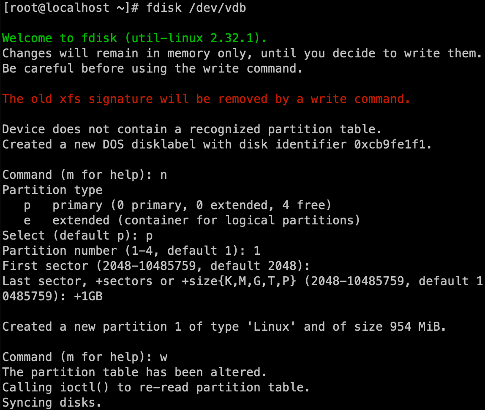

Un cop creat la partició, hem de formatejar-la i muntar-la:

```sh
mkfs.ext4 /dev/vdb1
mount /dev/vdb1 /mnt/data
df -h
```

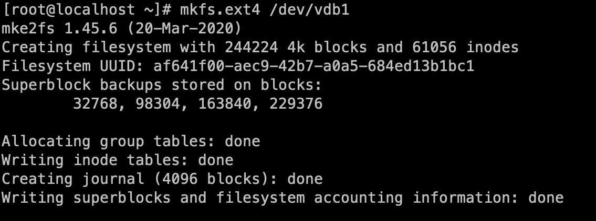

**Observació**: Si ara reiniciem la màquina virtual, observareu que els disc ja no estan muntants.

```sh
reboot
df -h
```

Quan s'emet una ordre **mount**, el muntatge només persistirà fins que es reiniciï la màquina. Si sempre volem que persisteixi aquest muntatge s'ha d'afegir una entrada */etc/fstab*.

Si consultem el contingut del fitxer */etc/fstab* observarem que hi ha una entrada per al disc */dev/vda1*:

```sh
vi /etc/fstab
```

```shell
UUID=6f15c206-f516-4ee8-a4b7-89ad880647db /                       xfs     defaults        0 0
```

- *Columna 1*: Device name or block id: Es pot utilizar un dispositiu local en xarxa identificat pel seu nom /dev/vdb1 o UUID.
- *Columna 2*: Mount point: Punt de montantge del sistema de fitxers (/). Per swap s'utilitza none.
- *Columna 3*: Type of filesystem: ext4, xfs, btrfs, f2fs, vfat, ntfs, hfs‐ plus, tmpfs, sysfs, proc, iso9660, udf, squashfs, nfs, cifs,...
- *Columna 4*: Mount options:
  - **defaults** = use default options: rw, suid, dev, exec, auto, nouser, and async.
  - **noauto** = do not mount when “mount -a” is given (e.g., at boot time)
  - **user** = allow a user to mount
  - **owner** = allow device owner to mount
- *Columna 5*: Ja no s'utiltiza...
- *Columna 6*: Ordre del boot t (root fs  (0), la resta (2))

Es recomana utilitzar el **UUID**, ja que els noms dels dispositius solen ser una coincidència de l’ordre de detecció del maquinari i poden canviar quan s’afegeixen o s’eliminen altres discs. Imagineu que heu connectat un altre disc a l'ordinador i que heu arrencat. Probablement no passarà, però és possible que el nou disc es pugui identificar com */dev/vdb*, cosa que provoca que el sistema busqui el contingut de */boot* a la primera partició d’aquest disc.

Amb l'ordre *blkid* podeu obtenir el **UUID** únic de cada dispositiu:

```sh
blkid
```

```shell
/dev/vda1: UUID=6f15c206-f516-4ee8-a4b7-89ad880647db
/dev/sr0:  UUID=2020-11-05-12-08-48-00
/dev/vdb1: UUID=f8579db6-4f88-4c21-8e5e-407d1b27db32
```

En el sistemes i servidors que configureu intenteu generar les següents particions:

|**Particions**|**Opcions**     |
|----------|----------------|
|/home|nodev {noexec}|
|/tmp|nodev, nosuid, noexec|
|/var||
|/var/log||
|/var/log/audit | |

On {} són opcions opcionals (depèn del tipus de sistema o servei). La resta indica:

- **noexec**: No permet executar binaris.
- **nodev**: No interprèta caràcters o blocs especials dels dispòsitius.
- **nosuid**: No permet a un usuari obtenir permisos de root per executar binaris.

Recordeu fer servir aquestes configuracions amb precaució i adaptar-les a les necessitats específiques del vostre sistema o servidor. Sempre és recomanable realitzar còpies de seguretat i provar les configuracions en un entorn segur abans d'implementar-les en producció.

## Cas d'exemple: Moure /home a una partició

En aquest cas d'exemple, mourem el directori */home* a una partició diferent. Aquesta partició la crearem al disc que ja heu creat. Per fer això, formatejeu una partició del disc amb el sistema de fitxer *xfs*.

Incialitzarem **home** amb alguns fitxers i directoris per simular i comprovar que no ens deixem res:

```sh
mkdir /home/sergi
mkdir /home/adria
touch /home/sergi/a.txt
touch /home/sergi/a.c
mkdir /home/adria/config
touch /home/adria/config/.vim
``````

1. Crearem un directori temporal per muntar la partició:

      ```sh
      mkdir /srv/home
      ```

2. Muntarem la partició al directori:

      ```sh
      mount /dev/vdb1 /srv/home
      ```

3. Copiarem tots els fitxers de */home* al directori temporal:

      ```sh
      cp -aR /home/* /srv/home/
      ```

4. Ens assegurem que no ens deixem res:

      ```sh
      diff -r /home/ /srv/home
      # No ha de sortir cap missatge
      ```

5. Eliminem tot el contingut de */home*:

      ```sh
      rm -rf /home/*
      ```

6. Desmontem la partició:

      ```sh
      umount /srv/home
      ```

7. Montem la partició al */home*:

      ```sh
      mount /dev/vdb1 /home
      ```

8. Obtenim el UUID:

      ```sh
      blkid /dev/vdb1
      ```

9. Afegim una entrada al fstab:

      ```sh
      vi /etc/fstab
      ```

      ```shell
      UUID=ebb60-88a0-4b37-ae47-a66baa1bb966 /home   xfs   nodev noexec   0   2
      ```

10. Reiniciem la màquina virtual:

      ```sh
      reboot
      ```

## Simulant una corrupicó a la partició /home

**NOTA**: Aquesta operació es realitzarà en una màquina virtual o un entorn d'aprenentatge i no en un entorn de producció. Aquesta operació pot provocar la pèrdua de dades.

En aquest cas d'exemple, simularem una corrupció a la partició */home* i utilitzarem l'eina **xfs_repair** per reparar-la. Per fer-ho necessitem instal·lar l'eina ```dnf install hexedit -y```.

1. Desmuntar la partició:

      ```sh
      umount /home
      ```

2. Obrir la partició amb l'eina **hexedit**:

      ```sh
      hexedit /dev/vdb1
      ```

3. Modifiqueu bits a l'atzar i deseu els canvis. Per fer-ho escriviu damunt dels valors hexadecimals altres valors. Un cop fet guardeu amb **Ctrl + X** i **Y**.

4. Ara si intenteu muntar el disc, obtindreu un error:

      ```sh
      mount /dev/vdb1 /home
      ```

      ```shell
      mount: /home: mount(2) system call failed: Structure needs cleaning.
      ```  

5. Ara podeu utilitzar la comanda ```xfs_ncheck``` per revisar el problema:

      ```sh
      xfs_ncheck /dev/vdb1
      ```

      ```shell
      Metadata CRC error detected at 0x557ea7984555, xfs_sb block 0x0/0x200
      Metadata corruption detected at 0x557ea7944f20, xfs_agfl block 0x3/0x200
      Metadata corruption detected at 0x557ea7944f20, xfs_agfl block 0xbe03/0x200
      Metadata corruption detected at 0x557ea7944f20, xfs_agfl block 0x17c03/0x200
      Metadata corruption detected at 0x557ea7944f20, xfs_agfl block 0x23a03/0x200
        131 adria/.
        132 exemple.txt
      65664 adria/config/.
      65665 adria/config/.vim
     142144 sergi/.
     142145 sergi/a.txt
     142146 sergi/a.
      ```

6. Utilitzarem la comanda **xfs_repair** per reparar la partició:

      ```sh
      xfs_repair /dev/vdb1
      ```

7. Revisem amb **xfs_ncheck** que la partició està reparada:

      ```sh
      xfs_ncheck /dev/vdb1
      ```

8. Finalment, podeu tornar a muntar la partició:

      ```sh
      mount /dev/vdb1 /home
      ```

## Sistema de Fitxers ZFS

El sistema de fitxers [ZFS](https://openzfs.github.io/openzfs-docs/Getting%20Started/RHEL-based%20distro/index.html) és un sistema de fitxers de 128 bits que va ser desenvolupat per Sun Microsystems. Aquest sistema de fitxers té una arquitectura de 128 bits que permet gestionar grans quantitats de dades i proporciona una gran fiabilitat, integritat i rendiment. Aquest sistema de fitxers proporciona una gran quantitat de funcions avançades que permeten gestionar i protegir les dades de forma eficient.

### Avantatges

- **Integritat de les dades**: Garanteix la integritat de les dades mitjançant la verificació de suma de comprovació (checksum) en totes les operacions d'escriptura i lectura. Això ajuda a detectar errors i corregir-los.
- **Escalabilitat**: Permet gestionar grans quantitats de dades i emmagatzemar-les de manera eficient en una arquitectura escalable.
- **Resiliència a les fallades**: Té funcionalitats de mirroring, striping i replicació de dades, que ajuden a mantenir les dades protegides contra fallades de disc i altres incidents.
- **Snapshots i Clons**: ZFS ofereix la capacitat de crear snapshots (instantànies) i clons (còpies virtuals) de les dades, facilitant la gestió de versions i la creació d'entorns de proves.
- **Compresió de dades**: Permet la compresió de dades en temps real, estalviant espai d'emmagatzematge sense sacrificar el rendiment.

### Inconvenients

- **Requisits de memòria**: Pot requerir una quantitat significativa de memòria RAM per funcionar de manera eficient, especialment en sistemes amb moltes dades i grans volums.
- **Complexitat**: És un sistema amb moltes característiques i opcions, la seva complexitat pot fer que sigui més difícil d'aprendre i gestionar.

### Instal·lació de ZFS

1. Instal·la el repositori EPEL:

      ```sh
      dnf install epel-release -y
       ```

2. Afegeix el repositori ZFS:

      ```sh
      dnf install https://zfsonlinux.org/epel/zfs-release-2-3$(rpm --eval "%{dist}").noarch.rpm -y
      ```

3. Instal·lació dels paquets necessaris:

      ```sh
      dnf dnf install kernel-devel
      ```

4. Actualitzar el sistema:

      ```sh
      dnf update -y
      ```

5. Segons la documentació, veure [Getting Started](https://openzfs.github.io/openzfs-docs/Getting%20Started/RHEL-based%20distro/index.html): Per defecte, el paquet zfs-release està configurat per instal·lar paquets de tipus DKMS perquè funcionin amb una àmplia gamma de kernels. Per poder instal·lar els mòduls kABI-tracking, cal canviar el repositori predeterminat de zfs a zfs-kmod.

      ```sh
      dnf config-manager --disable zfs
      dnf config-manager --enable zfs-kmod
      dnf install zfs
      ```

6. Reinicieu la màquina virtual:

      ```sh
      reboot
      ```

7. Carregeu el modul zfs al kernel de linux:

      ```sh
      modprobe zfs
      ```

### Creació d'un pool ZFS

Una pool ZFS és un conjunt de dispositius de blocs que es poden utilitzar per emmagatzemar dades. Aquesta pool pot estar formada per un o més dispositius de blocs. Aquests dispositius poden ser discos durs, SSD, dispositius de xarxa, etc. Aquesta pool es pot utilitzar per crear conjunts de dades i sistemes de fitxers ZFS. Utiltizarem el disc **/etc/vdb** per crear la pool.

1. Creació de la pool:

      ```sh
      zpool create -f zfspool /dev/vdb
      ```

2. Comprovació de la pool:

      ```sh
      zpool status
      ```

      ```shell
      pool: zfspool
      state: ONLINE
      scan: none requested
      config:

      NAME        STATE     READ WRITE CKSUM
      zfspool     ONLINE       0     0     0
        vdb       ONLINE       0     0     0

      errors: No known data errors
      ```

3. Creació d'un sistema de fitxers que anomenarem (dades):

      ```sh
      zfs create zfspool/dades
      ```

4. Comprovació del conjunt de dades:

      ```sh
      zfs list
      ```

      ```shell
      NAME            USED  AVAIL     REFER  MOUNTPOINT
      zfspool         135K   352M     25.5K  /zfspool
      zfspool/dades    24K   352M       24K  /zfspool/dades
      ```

      **NOTA**: Ara mateix tenim muntats dos sistemes de fitxers: **zfspool** i **zfspool/dades**. Per defecte, els sistemes de fitxers ZFS es muntaran a */zfspool* i */zfspool/dades*. Però, podem canviar aquest comportament i muntar els sistemes de fitxers a un altre directori.

5. Anem a canviar el punt de muntatge de **zfspool/dades** a */mnt/dades*:

      ```sh
      mkdir /mnt/dades
      ```

      ```sh
      zfs set mountpoint=/mnt/dades zfspool/dades
      ```

      ```sh
      zfs list
      ```

      ```shell
      NAME            USED  AVAIL     REFER  MOUNTPOINT
      zfspool         135K   352M     25.5K  /zfspool
      zfspool/dades    24K   352M       24K  /mnt/dades
      ```

6. Ara crearem uns quants fitxers i directoris a **/mnt/data**:

      ```sh
      mkdir /mnt/dades/sergi
      mkdir /mnt/dades/adria
      touch /mnt/dades/sergi/a.txt
      touch /mnt/dades/sergi/a.c
      mkdir /mnt/dades/adria/config
      touch /mnt/dades/adria/config/.vim
      ```

7. ZFS ens permet crear snapshots (instantànies) dels nostres sistemes de fitxers. Aquestes instantànies són còpies de seguretat dels nostres sistemes de fitxers en un moment determinat. Aquestes instantànies es poden utilitzar per restaurar els nostres sistemes de fitxers en cas de fallada o error. Crearem una instantània del nostre sistema de fitxers **zfspool/dades**:

      ```sh
      zfs snapshot zfspool/dades@snap1
      ```

8. Ara eliminarem el directori **/mnt/dades/adria/config**:

      ```sh
      rm -rf /mnt/dades/adria/config
      ```

9. Podem utilitzar la comanda **zfs rollback** per restaurar el nostre sistema de fitxers a l'estat de l'instantània:

      ```sh
      zfs rollback zfspool/dades@snap1
      ```

10. Comprovem que el directori **/mnt/dades/adria/config** ha estat restaurat:

      ```sh
      ls -la /mnt/dades/adria/config
      ```

      ```shell
      total 2
      drwxr-xr-x. 2 root root 3 Oct  3 10:01 .
      drwxr-xr-x. 3 root root 3 Oct  3 10:01 ..
      -rw-r--r--. 1 root root 0 Oct  3 10:01 .vim
      ```

11. Podem utilitzar la comanda **zfs clone** per crear un clon del nostre sistema de fitxers **zfspool/dades**:

      ```sh
      zfs clone zfspool/dades@snap1 zfspool/dades/clone1
      ```

      **OBSERVACIÓ 1**: Els clons en ZFS permeten realitzar migracions de dades eficients i segures. Abans d'efectuar canvis en el sistema de producció o transferir dades a un nou sistema, es pot crear un clon de les dades existents per provar la migració sense afectar les dades originals

      **OBSERVACIÓ 2**: Quan es requereix realitzar operacions de processament, anàlisi o transformació de dades, els clons permeten fer-ho sense modificar o posar en perill les dades originals.

      ```sh
      zfs list
      ```

      ```shell
      NAME                   USED  AVAIL     REFER  MOUNTPOINT
      zfspool                217K   352M       24K  /zfspool
      zfspool/dades           43K   352M       29K  /mnt/dades
      zfspool/dades/clone1     0B   352M       29K  /mnt/dades/clone1
      ```
